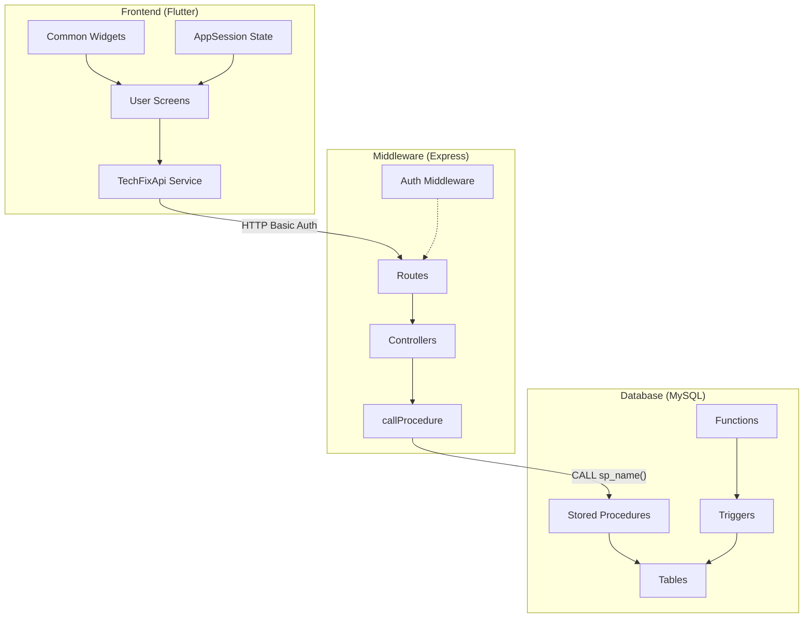
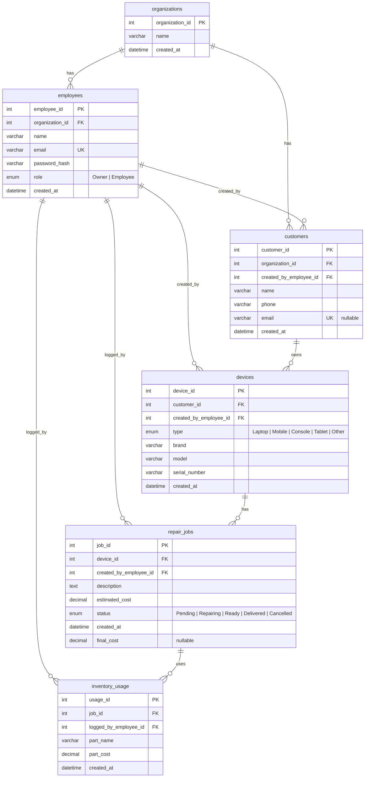
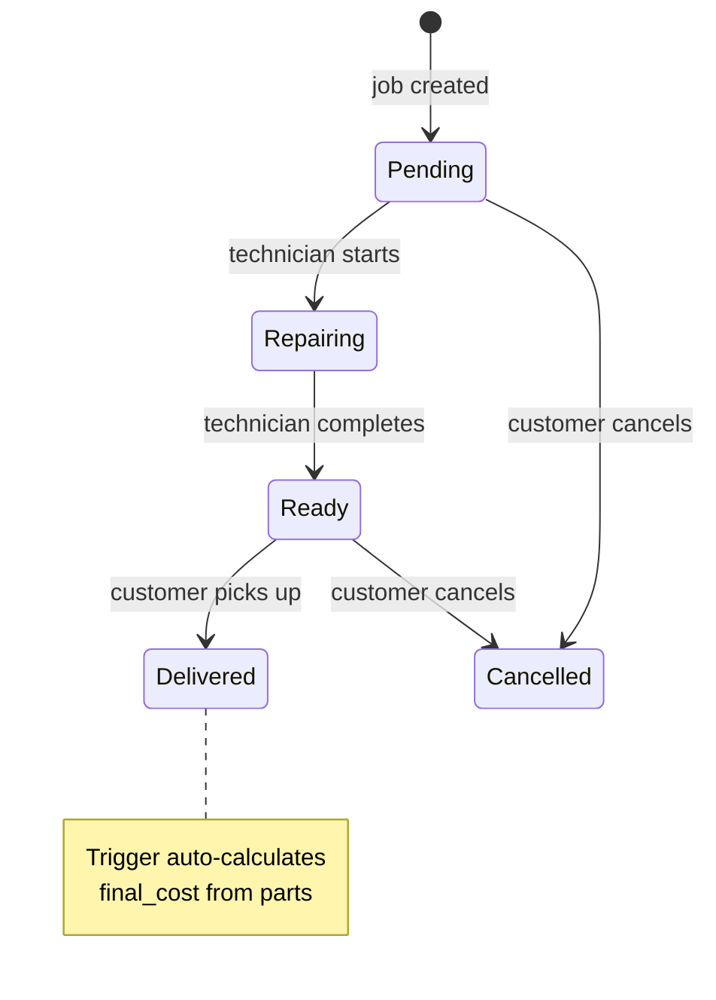
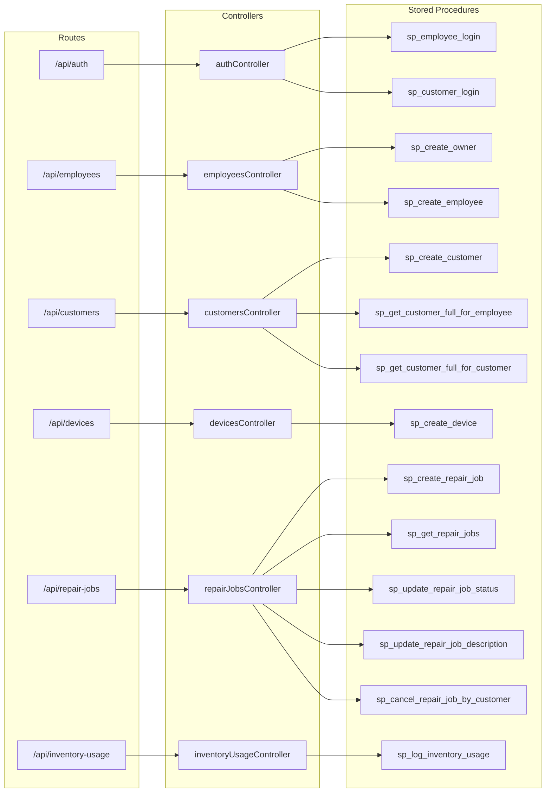
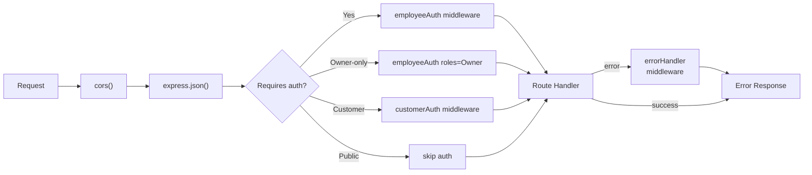
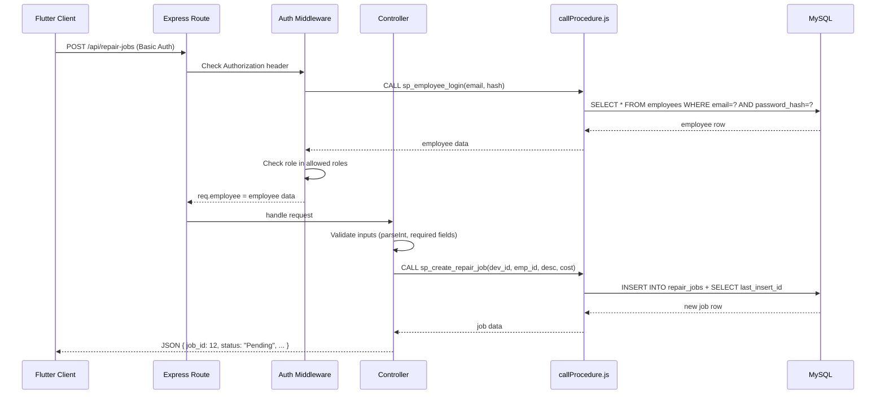
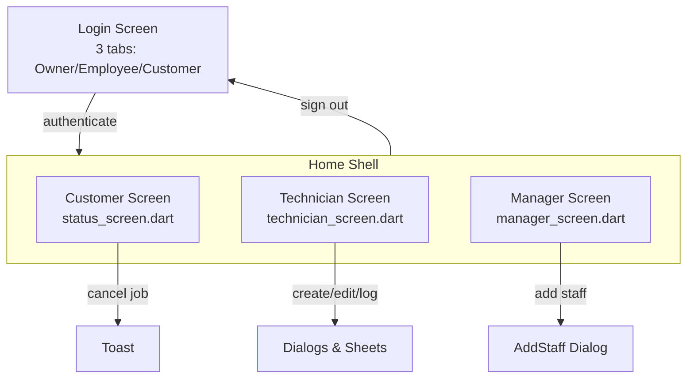
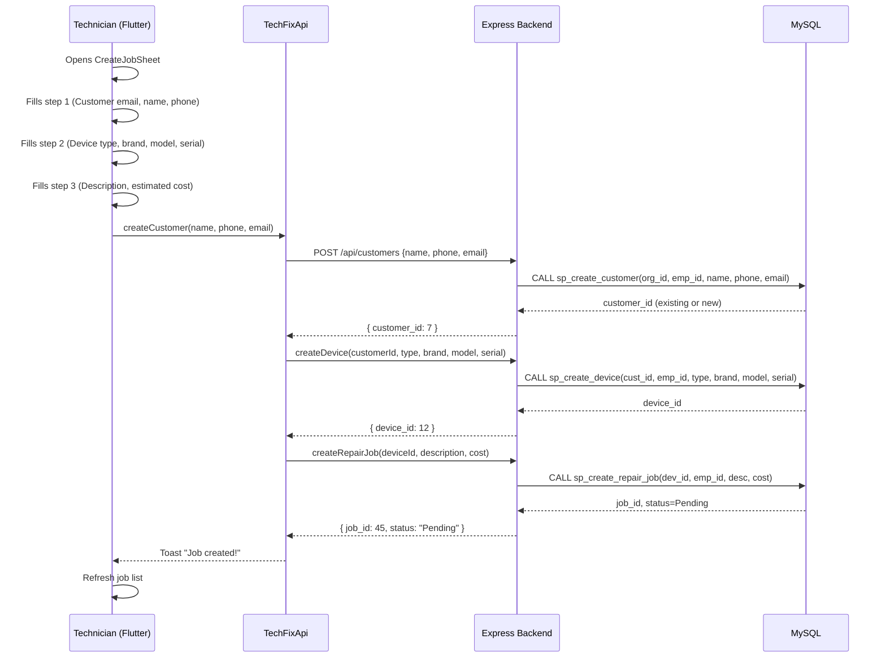
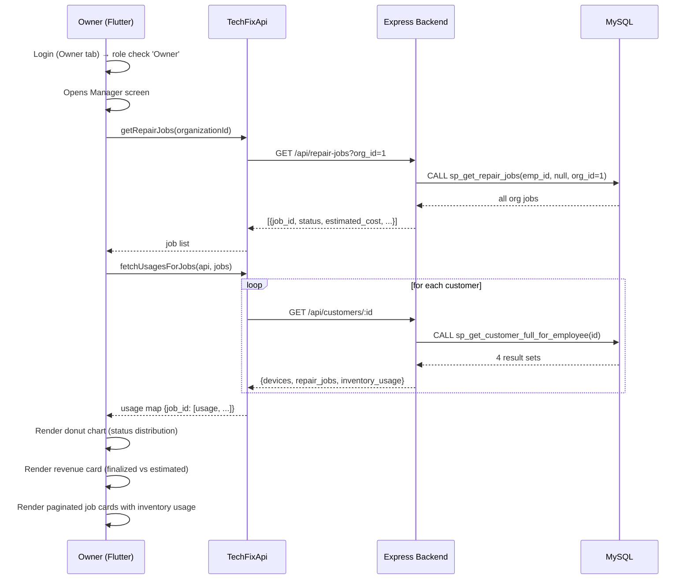

# TechFix — Digital Repair Workflow Manager

> A centralized repair workflow management system for local repair shops built with Flutter, Node.js/Express, and MySQL.

---

## Architecture Overview



### Layer Responsibilities

| Layer | Technology | Role |
|-------|------------|------|
| **Frontend** | Flutter 3.x (Dart) | UI rendering, local state, API consumption |
| **Backend** | Node.js + Express 5 | Route handling, auth enforcement, input validation |
| **Database** | MySQL 8 | All business logic via stored procedures, triggers, FK constraints |

---

## Project Structure

```
TechFix/
├── AGENTS.md                           # Agent instructions for root
├── CONTEXT.md                          # Single source of truth / phase tracker
├── DOCUMENTATION.md                    # This file
├── backend/                            # Node.js + Express API
│   ├── package.json
│   ├── .env                            # DB_HOST, DB_PORT, DB_USER, DB_PASSWORD, DB_NAME
│   └── src/
│       ├── app.js                      # Express app factory (DI for pool)
│       ├── server.js                   # Entry point — starts listener
│       ├── routes/                     # 6 route files, ~100 lines total
│       ├── controllers/                # 6 controller files, ~550 lines total
│       ├── middleware/
│       │   ├── auth.js                 # Employee auth + Customer auth middleware
│       │   └── errorHandler.js         # Global error handler
│       ├── db/
│       │   ├── pool.js                 # mysql2/promise connection pool
│       │   └── callProcedure.js        # CALL sp_name() helper (single + multi)
│       └── utils/
│           ├── auth.js                 # SHA256 hashing + Basic Auth parser
│           └── validation.js           # Required field + numeric validators
├── database/
│   ├── techfix.sql                     # Schema: 6 tables, FKs, indexes
│   ├── techfix_routines.sql            # 1 function + 12 stored procedures
│   ├── techfix_triggers.sql            # 1 trigger (final_cost auto calc)
│   └── techfix_seed.sql                # Sample data: 1 org, 1 owner, 3 employees
├── frontend/
│   └── techfix/
│       ├── pubspec.yaml
│       └── lib/
│           ├── main.dart               # App entry point
│           ├── config/api_config.dart  # Base URL configuration
│           ├── models/                 # 2 data models (RepairJob, InventoryUsage)
│           ├── screens/                # 3 main screens + sub-modules
│           ├── services/techfix_api.dart # REST client (350 lines)
│           ├── shared/utils.dart       # signOut(), fmtMoney(), constants
│           ├── state/                  # AppSession (ChangeNotifier) + Scope
│           ├── theme/app_theme.dart    # Design tokens, ColorScheme, TextTheme
│           └── widgets/               # 16 reusable widgets
└── docs/                               # Project proposal materials
```

---

## Database

### Entity Relationship



### Status Lifecycle



### Stored Procedures & Functions

| Name | Type | Inputs | Returns | Purpose |
|------|------|--------|---------|---------|
| `fn_parts_total` | FUNCTION | `p_job_id` | DECIMAL | Sum of all part costs for a job |
| `sp_create_owner` | PROCEDURE | org_name, name, email, hash | rows | Creates org + owner (transactional) |
| `sp_create_employee` | PROCEDURE | org_id, name, email, hash | rows | Creates employee under an org |
| `sp_employee_login` | PROCEDURE | email, hash | rows | Authenticates employee by email + password |
| `sp_customer_login` | PROCEDURE | email | rows | Authenticates customer by email |
| `sp_create_customer` | PROCEDURE | org_id, emp_id, name, phone, email | rows | Creates or returns existing customer by email |
| `sp_create_device` | PROCEDURE | cust_id, emp_id, type, brand, model, serial | rows | Creates device linked to customer |
| `sp_create_repair_job` | PROCEDURE | dev_id, emp_id, desc, cost | rows | Creates repair job with status Pending |
| `sp_log_inventory_usage` | PROCEDURE | job_id, emp_id, name, cost | rows | Logs a part used |
| `sp_update_repair_job_status` | PROCEDURE | job_id, status | rows | Updates status (blocks Cancelled/Delivered) |
| `sp_update_repair_job_description` | PROCEDURE | job_id, desc | rows | Updates description (blocks Cancelled) |
| `sp_cancel_repair_job_by_customer` | PROCEDURE | job_id | rows | Customer cancels only Pending jobs |
| `sp_get_repair_jobs` | PROCEDURE | emp_id, status?, org_id? | result set | Fetches jobs; org_id=manager view, null=technician |
| `sp_get_customer_full_for_employee` | PROCEDURE | cust_id | 4 result sets | Customer + devices + jobs + usage (employee) |
| `sp_get_customer_full_for_customer` | PROCEDURE | email | 4 result sets | Customer + devices + jobs + usage (self) |

### Trigger

```sql
-- When a job is marked Delivered, auto-set final_cost = fn_parts_total(job_id)
CREATE TRIGGER tr_repair_jobs_delivered_cost
BEFORE UPDATE ON repair_jobs
FOR EACH ROW
  IF NEW.status = 'Delivered' AND OLD.status != 'Delivered' THEN
    SET NEW.final_cost = fn_parts_total(NEW.job_id);
  END IF;
```

---

## Backend (Express API)

### Route → Controller → Procedure Mapping



### Middleware Chain



### API Endpoints

| Method | Route | Auth Required | Access | Purpose |
|--------|-------|---------------|--------|---------|
| `POST` | `/api/auth/employee` | Basic | Public | Employee login (owner + tech) |
| `POST` | `/api/auth/customer` | Basic | Public | Customer login |
| `POST` | `/api/employees/owner` | Public | — | Create org + owner account |
| `POST` | `/api/employees` | Employee | Owner | Create employee |
| `POST` | `/api/customers` | Employee | All | Register customer |
| `GET` | `/api/customers/:id` | Employee | All | Full customer data (4 result sets) |
| `GET` | `/api/customers/me` | Customer | — | Self-service customer data |
| `POST` | `/api/devices` | Employee | All | Check in device |
| `GET` | `/api/repair-jobs` | Employee | All | List jobs (optional org filter) |
| `POST` | `/api/repair-jobs` | Employee | All | Create repair job |
| `PUT` | `/api/repair-jobs/:job_id` | Employee | All | Update status |
| `PUT` | `/api/repair-jobs/:id/description` | Employee | All | Update description |
| `POST` | `/api/repair-jobs/:id/cancel` | Customer | — | Customer cancels pending job |
| `POST` | `/api/inventory-usage` | Employee | All | Log part used |

### Data Flow: Full Request Lifecycle



---

## Frontend (Flutter)

### Screen Navigation



### Role-Based Tab Visibility

| Role | Customer Tab | Technician Tab | Manager Tab |
|------|:---:|:---:|:---:|
| **Customer** | ✅ | — | — |
| **Employee** (Technician) | — | ✅ | — |
| **Owner** | — | — | ✅ |
| **Manager** | ✅ | ✅ | ✅ |

### Widget Hierarchy

```mermaid
graph TB
    subgraph "Shared Widgets (lib/widgets/)"
        AB[AppBackground]
        AV[Avatar]
        ES[EmptyState]
        ER[ErrorState]
        FD[Field]
        FC[FilterChipWidget]
        JC[JobCard]
        LS[LoadingState]
        PL[Pill]
        SH[SectionHeader]
        ST[Sheet]
        SC[StatCard]
        SB[StatusBadge]
        TD[TechFixDialog]
        TT[Toast]
    end

    subgraph "Screens"
        subgraph "Technician Screen"
            TS[technician_screen.dart]
            SRD[status_radio_dialog.dart]
            EDD[edit_desc_dialog.dart]
            CJS[create_job_sheet.dart]
            LPS[log_part_sheet.dart]
        end
        subgraph "Manager Screen"
            MS[manager_screen.dart]
            ASD[add_staff_dialog.dart]
            DP[donut_painter.dart]
        end
        subgraph "Customer Screen"
            CS[customer_status_screen.dart]
        end
    end

    subgraph "Services & State"
        API[TechFixApi]
        AS[AppSession]
        AS_SCOPE[AppSessionScope]
    end

    TS --> SRD & EDD & CJS & LPS
    TS --> AB & FC & JC & LS & ES & ER & TT
    MS --> AB & ASD & DP & JC & LS & ES & ER & TT & SH
    CS --> AB & AV & PL & SB & SC & SH & LS & ES & ER & TT

    SRD & EDD & ASD --> TD
    CJS & LPS --> ST
    CJS & LPS & EDD & ASD --> FD

    TS & MS & CS --> API
    TS & MS & CS --> AS_SCOPE
    AS_SCOPE --> AS
    API --> HTTP[HTTP Client]
```



### File Inventory

| Directory | File | Lines | Responsibility |
|-----------|------|-------|----------------|
| **models/** | `repair_job.dart` | 69 | `RepairJob` data class with `fromApi()` factory |
| | `inventory_usage.dart` | 33 | `InventoryUsage` data class |
| **screens/** | `login_screen.dart` | 779 | 3-tab auth (Owner/Employee/Customer) |
| | `home_shell.dart` | 106 | `IndexedStack` + `NavigationBar`, role-based routing |
| | `customer_status_screen.dart` | 686 | Profile card, device list, job status tracking |
| | `technician_screen.dart` | 470 | Job list with search/filter, FAB |
| | `technician/status_radio_dialog.dart` | 99 | Radio selector for job status changes |
| | `technician/edit_desc_dialog.dart` | 76 | Edit description + estimated cost |
| | `technician/create_job_sheet.dart` | 306 | 3-step bottom sheet (Customer→Device→Issue) |
| | `technician/log_part_sheet.dart` | 152 | Log inventory usage against a job |
| | `manager_screen.dart` | 438 | Donut chart, revenue card, paginated jobs |
| | `manager/add_staff_dialog.dart` | 109 | Add technician form dialog |
| | `manager/donut_painter.dart` | 74 | `CustomPainter` donut chart + `LegendDot` |
| **services/** | `techfix_api.dart` | 350 | REST client — all endpoint methods |
| **shared/** | `utils.dart` | 17 | `signOut()`, `fmtMoney()`, `emailRegex`, `minPasswordLength` |
| **state/** | `app_session.dart` | 42 | `ChangeNotifier` — credentials, employee, `isOwner` |
| | `app_session_scope.dart` | 16 | `InheritedNotifier` accessor |
| **theme/** | `app_theme.dart` | 127 | Color tokens, `statusColor/Bg/Icon/Label`, `TextTheme` |
| **widgets/** | 16 files | ~1,500 total | All reusable UI components |
| **Total** | **33 files** | **~4,670** | |

### Design Tokens

| Token | Hex | Usage |
|-------|-----|-------|
| **Coral** | `#F26B4A` | Primary actions, owner mode |
| **Teal** | `#2A9D8F` | Success states, employee mode |
| **Sky** | `#2D7BD1` | Info, customer mode |
| **Clay** | `#B86B4B` | Inventory actions |
| **Ink** | `#141414` | Text, icons |
| **Cream** | `#F7F3ED` | Subtle backgrounds |
| **Beige** | `#EFE7DA` | Card backgrounds |
| **Grey** | `#9A958C` | Muted text |

Derived: `line` (border), `line2` (light border), `muted` (secondary text), `faint` (tertiary text).

---

## End-to-End Scenarios

### Scenario 1: Technician creates a repair job



### Scenario 2: Owner views dashboard



---

## Key Decision Log

| Decision | Rationale |
|----------|-----------|
| Business logic in stored procedures | Single source of truth; all clients get same rules regardless of backend language |
| Basic Auth (no JWT/sessions) | Minimal complexity for a local shop tool; passwords hashed with SHA256 |
| Flutter ChangeNotifier + InheritedNotifier | Simple state management; no external dependency needed for 3 screens |
| No mock data | All screens wired to real API from day one; `mock_data.dart` deleted |
| Custom Paint for donut chart | Avoided `fl_chart` dependency; chart is simple enough for native `CustomPainter` |
| Dialog/sheet extraction | `StatusRadioDialog`, `EditDescDialog`, `AddStaffDialog` → `TechFixDialog` shell; `CreateJobSheet`, `LogPartSheet` → `Sheet` shell |
| Role checked on frontend after auth | Backend could reject by role too (middleware supports `roles` filter), but frontend check gives friendlier error messages |

---

## Running the Project

### Database
```bash
mysql -u root -p < database/techfix.sql
mysql -u root -p < database/techfix_routines.sql
mysql -u root -p < database/techfix_triggers.sql
mysql -u root -p < database/techfix_seed.sql
```

### Backend
```bash
cd backend
npm install
npm start    # or: npm run dev (nodemon)
```

### Frontend
```bash
cd frontend/techfix
flutter pub get
flutter run
```
