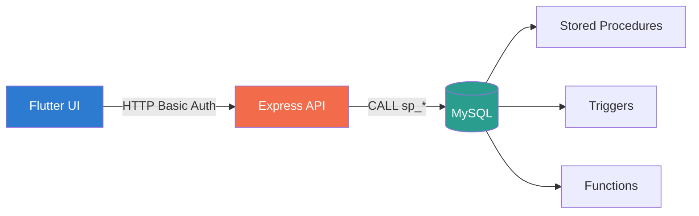

# TechFix — Digital Repair Workflow Manager

> A centralized repair shop management system for local electronics repair shops. **3-tier**: Flutter UI → Node.js/Express API → MySQL database with all business logic in stored procedures.

---

## Table of Contents

1. [Architecture](#architecture)
2. [Features](#features)
3. [Tech Stack](#tech-stack)
4. [Getting Started](#getting-started)
5. [Database Setup](#database-setup)
6. [Running the App](#running-the-app)
7. [Demo Credentials](#demo-credentials)
8. [Project Structure](#project-structure)
9. [API Overview](#api-overview)
10. [Documentation](#documentation)

---

## Architecture



**Key principle:** The frontend and backend never execute raw SQL. All data operations are encapsulated in 12 stored procedures, 1 function, and 1 trigger. The backend validates inputs, calls routines, and formats responses — nothing more.

---

## Features

| Role | Capabilities |
|------|-------------|
| **Owner** | Dashboard with donut chart (status distribution), revenue tracking (finalized vs estimated with progress bar), paginated job list with inventory usage, add/remove technicians |
| **Technician** | Job list with search/filter, 3-step job creation (customer → device → issue), log part usage, update job status, edit job description/cost |
| **Customer** | Self-service portal — view profile, browse devices, track repair jobs with status badges, cancel pending jobs |
| **All** | Real API integration (zero mock data), role-based tab visibility, Toast action feedback, input validation on all forms |

---

## Tech Stack

| Layer | Technology | Role |
|-------|------------|------|
| **Frontend** | Flutter 3.x (Dart) | Material 3, `ChangeNotifier` state, `Google Fonts` Space Grotesk |
| **Backend** | Node.js + Express 5 | Route handling, auth enforcement, input validation |
| **Database** | MySQL 8.0 (InnoDB) | All business logic via stored procedures + triggers |
| **Auth** | HTTP Basic Auth | Password-hashed employee login + email-only customer login |
| **State** | `InheritedNotifier` | Scoped `AppSession` with credentials + employee data |

---

## Getting Started

### Prerequisites
- Node.js ≥ 18
- MySQL 8.0+
- Flutter 3.x + Dart SDK ≥ 3.11
- A code editor (VS Code recommended)

### 1. Clone & Install

```bash
git clone <repo-url>
cd TechFix

# Backend
cd backend
cp .env.example .env    # Then edit .env with your DB credentials
npm install

# Frontend
cd ../frontend/techfix
cp .env.example .env    # Then edit .env with your API URL
flutter pub get
```

### 2. Configure Environment

**Backend** (`backend/.env`):
```env
PORT=3000
DB_HOST=127.0.0.1
DB_PORT=3306
DB_USER=root
DB_PASSWORD=your_mysql_password
DB_NAME=techfix
```

**Frontend** (`frontend/techfix/.env`):
```env
API_BASE_URL=http://localhost:3000
```

| Platform | `API_BASE_URL` value |
|----------|---------------------|
| Local dev (Chrome) | `http://localhost:3000` |
| Android emulator | `http://10.0.2.2:3000` |
| Android device | `http://<your-ip>:3000` |
| iOS simulator | `http://localhost:3000` |
| iOS device | `http://<your-ip>:3000` |

> ⚠️ The `.env` file is in `.gitignore` — your credentials and API URL stay local.

---

## Database Setup

```bash
# Run in order (from project root)
mysql -u root -p < database/techfix.sql
mysql -u root -p < database/techfix_routines.sql
mysql -u root -p < database/techfix_triggers.sql
mysql -u root -p < database/techfix_seed.sql
```

This creates the `techfix` database with:
- **6 tables**: `organizations`, `employees`, `customers`, `devices`, `repair_jobs`, `inventory_usage`
- **1 function**: `fn_parts_total(job_id)` — sums part costs
- **12 procedures**: setup, auth, CRUD, read (see [full catalog](database/DATABASE_DOCUMENTATION.md#stored-procedure--function-catalog))
- **1 trigger**: auto-calculates `final_cost` on delivery
- **Seed data**: 1 org, 4 employees, 5 customers, 8 devices, 10 repair jobs, 7 inventory entries

---

## Running the App

```bash
# Terminal 1 — Backend
cd backend
npm start          # or: npm run dev (nodemon)

# Terminal 2 — Frontend
cd frontend/techfix
flutter run        # or: flutter run -d chrome
```

The backend starts on `http://localhost:3000` by default. The Flutter app reads the API URL from `frontend/techfix/.env`.

---

## Demo Credentials

After seeding, the following accounts are available:

### Owner
| Email | Password | Role |
|-------|----------|------|
| `owner@techfix.com` | `Owner123` | Owner |

### Technicians
| Email | Password | Name |
|-------|----------|------|
| `bilal.tech@techfix.com` | `Tech123` | Bilal Hussain |
| `hira.tech@techfix.com` | `Tech123` | Hira Khan |
| `usman.tech@techfix.com` | `Tech123` | Usman Ali |

### Customers (email-only login, no password)
| Email | Name |
|-------|------|
| `ayesha@example.com` | Ayesha Malik |
| `bilal@example.com` | Bilal Ahmed |
| `sara@example.com` | Sara Iqbal |
| `junaid@example.com` | Junaid Ahmad |
| `mohsin@example.com` | Mohsin Qureshi |

> **Login tabs:** Owner tab has both Sign In and Sign Up (create new org + owner). Technician tab is for Employee sign-in. Customer tab is email-only sign-in.

---

## Project Structure

```
TechFix/
├── README.md                        # This file
├── AGENTS.md                        # Agent instructions
├── CONTEXT.md                       # Session state tracker
├── DOCUMENTATION.md                 # Full architecture docs
├── backend/                         # Node.js + Express API
│   ├── .env                         # DB credentials (gitignored)
│   └── src/
│       ├── app.js                   # Express factory (DI for pool)
│       ├── server.js                # Entry point
│       ├── routes/                  # 6 route files
│       ├── controllers/             # 6 controller files
│       ├── middleware/
│       │   ├── auth.js              # Employee + Customer auth
│       │   └── errorHandler.js      # Global error handler
│       ├── db/
│       │   ├── pool.js              # mysql2 connection pool
│       │   └── callProcedure.js     # CALL helper (single + multi)
│       └── utils/
│           ├── auth.js              # SHA256 hashing, Basic Auth parser
│           └── validation.js        # Input validators
├── database/
│   ├── DATABASE_DOCUMENTATION.md    # Full DB documentation
│   ├── techfix.sql                  # Schema (6 tables)
│   ├── techfix_routines.sql         # 1 function + 12 procedures
│   ├── techfix_triggers.sql         # 1 trigger
│   └── techfix_seed.sql             # Demo data
├── frontend/
│   ├── FRONTEND_DOCUMENTATION.md    # Full frontend documentation
│   └── techfix/
│       ├── .env                     # API_BASE_URL (gitignored)
│       └── lib/
│           ├── main.dart            # Entry point
│           ├── config/              # ApiConfig (reads .env)
│           ├── models/              # RepairJob, InventoryUsage
│           ├── screens/             # 5 screens + 6 extracted modules
│           ├── services/            # TechFixApi (REST client)
│           ├── shared/              # utils.dart (signOut, fmtMoney)
│           ├── state/               # AppSession (ChangeNotifier)
│           ├── theme/               # AppTheme (design tokens)
│           └── widgets/             # 15 reusable widgets
└── docs/                            # Project proposal materials
```

---

## API Overview

### Endpoints (14 total)

| Method | Route | Auth | Purpose |
|--------|-------|------|---------|
| `POST` | `/api/auth/employee` | Basic | Employee login |
| `POST` | `/api/auth/customer` | Basic | Customer login |
| `POST` | `/api/employees/owner` | — | Create org + owner |
| `POST` | `/api/employees` | Owner | Create employee |
| `POST` | `/api/customers` | Employee | Register customer |
| `GET` | `/api/customers/:id` | Employee | Full customer data |
| `GET` | `/api/customers/me` | Customer | Self-service data |
| `POST` | `/api/devices` | Employee | Check in device |
| `GET` | `/api/repair-jobs` | Employee | List jobs |
| `POST` | `/api/repair-jobs` | Employee | Create job |
| `PUT` | `/api/repair-jobs/:id` | Employee | Update status |
| `PUT` | `/api/repair-jobs/:id/description` | Employee | Update desc |
| `POST` | `/api/repair-jobs/:id/cancel` | Customer | Cancel job |
| `POST` | `/api/inventory-usage` | Employee | Log part |

All business logic is in stored procedures — endpoints merely: **validate → CALL → respond**.

---

## Documentation

| File | Covers |
|------|--------|
| [`DOCUMENTATION.md`](DOCUMENTATION.md) | Architecture overview, ERD, widget hierarchy, API mapping, end-to-end scenarios |
| [`database/DATABASE_DOCUMENTATION.md`](database/DATABASE_DOCUMENTATION.md) | ERD/EERD, status state machine, table specs, procedure catalog, trigger, seed walkthrough, call sequences |
| [`frontend/FRONTEND_DOCUMENTATION.md`](frontend/FRONTEND_DOCUMENTATION.md) | Screen breakdown, widget reference, state management, design tokens, validation, toast system |
| [`CONTEXT.md`](CONTEXT.md) | Session state — completed work, decisions, blockers |
| [`backend/CONTEXT.md`](backend/CONTEXT.md) | Backend endpoints, test results, DB notes |
| [`database/CONTEXT.md`](database/CONTEXT.md) | Database schema, routines, rules |

---

> Built with ❤️ using Flutter, Express, and MySQL — all business logic in stored procedures.
