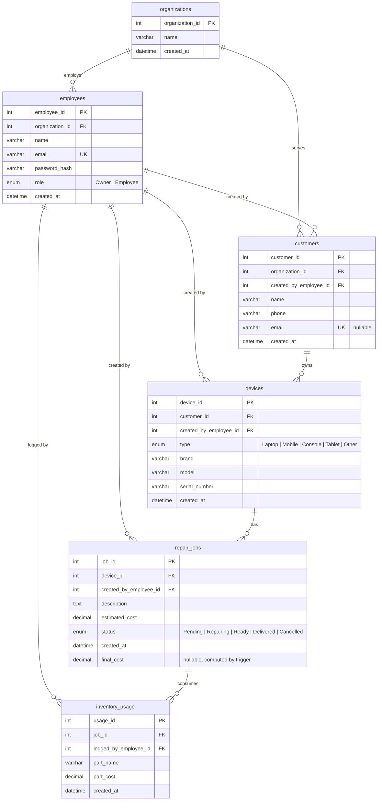
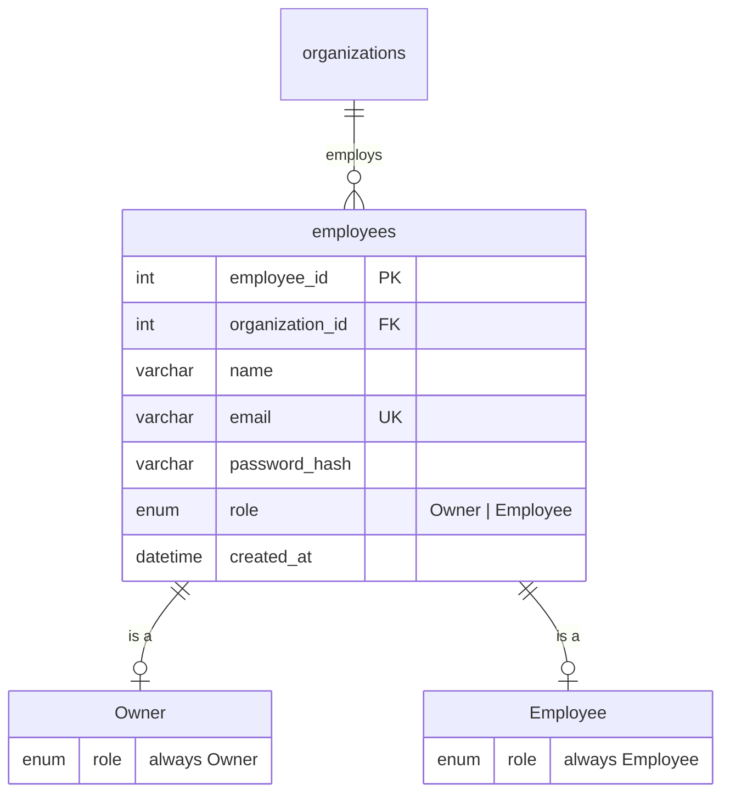
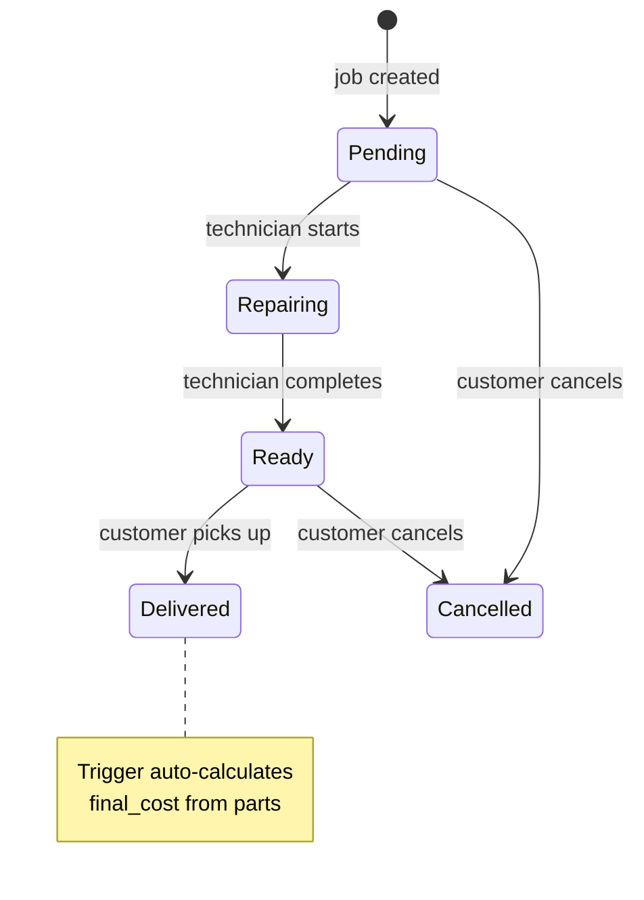
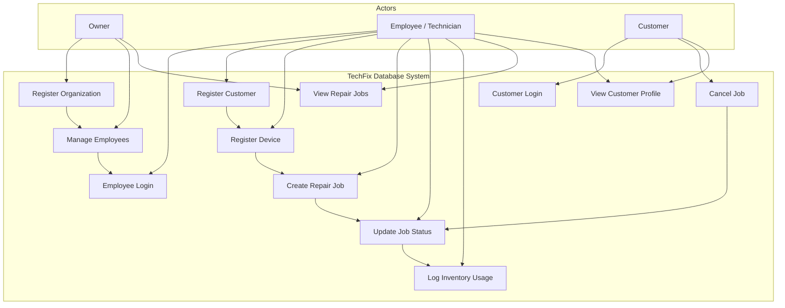

# TechFix Database Report — Repair Workflow Management System

---

## Table of Contents

1. [Introduction](#1-introduction)
2. [Domain Selection](#2-domain-selection)
3. [Problem Statement](#3-problem-statement)
4. [Novelty](#4-novelty)
5. [Entity Relationship Diagram (ERD)](#5-entity-relationship-diagram-erd)
   - [5.1 Enhanced ERD — Role Specialization](#51-enhanced-erd--role-specialization)
   - [5.2 Status Lifecycle State Machine](#52-status-lifecycle-state-machine)
6. [Entity Specifications](#6-entity-specifications)
   - [6.1 organizations](#61-organizations)
   - [6.2 employees](#62-employees)
   - [6.3 customers](#63-customers)
   - [6.4 devices](#64-devices)
   - [6.5 repair_jobs](#65-repair_jobs)
   - [6.6 inventory_usage](#66-inventory_usage)
7. [Constraints Summary](#7-constraints-summary)
   - [Foreign Key Relationships](#foreign-key-relationships)
8. [DBMS Features Used](#8-dbms-features-used)
   - [8.1 SQL Queries](#81-sql-queries)
   - [8.2 JOINs](#82-joins)
   - [8.3 Stored Procedures](#83-stored-procedures-12-total)
   - [8.4 Functions](#84-functions)
   - [8.5 Triggers](#85-triggers)
   - [8.6 Nested Subqueries](#86-nested-subqueries)
   - [8.7 Indexes](#87-indexes)
   - [8.8 ENUM Data Types](#88-enum-data-types)
   - [8.9 Transactions](#89-transactions)
   - [8.10 Error Handling](#810-error-handling)
9. [Stored Procedure / Function Catalog](#9-stored-procedure--function-catalog)
   - [9.1 Function](#91-function)
   - [9.2 Organization & Employee Setup](#92-organization--employee-setup)
   - [9.3 Authentication](#93-authentication)
   - [9.4 Create Records](#94-create-records)
   - [9.5 Update Records](#95-update-records)
   - [9.6 Read Records](#96-read-records)
   - [9.7 Usage Matrix](#97-usage-matrix-procedure--table)
10. [Trigger Details](#10-trigger-details)
11. [Use-Case Diagram](#11-use-case-diagram)
    - [Use-Case Summary](#use-case-summary)
12. [Sample Query Results](#12-sample-query-results)
    - [12.1 Parts Total Function](#121-parts-total-function)
    - [12.2 Trigger Auto-Calculation](#122-trigger-auto-calculation)
    - [12.3 Customer Full Profile](#123-customer-full-profile)
13. [Seed Data Walkthrough](#13-seed-data-walkthrough)
14. [Conclusion](#14-conclusion)

---

## 1. Introduction

TechFix is a digital repair workflow management system designed for small-to-medium electronics repair shops. The system replaces paper-based job cards and verbal handoffs with a centralized database-driven platform that tracks the complete lifecycle of a repair job — from device check-in to final delivery and cost settlement.

This report documents the complete database design and implementation of TechFix using MySQL 8.0. The database serves as the single source of truth, housing all business logic within stored procedures, functions, and triggers. The application layer (Node.js/Express) strictly validates inputs and calls database routines — it never executes raw DML, ensuring data integrity and consistency at the database level.

---

## 2. Domain Selection

The electronics repair industry was selected as the project domain for the following reasons:

- **Real-world relevance**: Local repair shops (mobile, laptop, console repairs) are ubiquitous but largely under-digitized. Most still rely on paper job slips and verbal tracking.
- **Rich data relationships**: The domain naturally involves multiple interconnected entities — customers, devices, repair jobs, employees, inventory parts — making it ideal for demonstrating relational database design.
- **Clear workflow**: Repair jobs follow a well-defined state machine (Pending → Repairing → Ready → Delivered/Cancelled), providing a natural fit for enforcing business rules through DBMS constraints and triggers.
- **Multi-tenant requirement**: Each repair shop operates independently, requiring org-scoped data isolation — a common real-world pattern.

---

## 3. Problem Statement

Local electronics repair shops face several operational challenges:

- **Lost or misplaced job cards** — Paper-based tracking lacks reliability and audit history.
- **Unclear job status** — Customers and technicians have no real-time visibility into where a repair stands.
- **Inaccurate cost calculations** — Final costs are often computed manually, leading to errors or disputes.
- **No parts tracking** — There is no systematic record of which parts were used in which repair, making it difficult to calculate profitability.
- **No centralized customer history** — Repeat customers have no consolidated device or repair history, forcing staff to rely on memory.

TechFix addresses these problems by providing a structured, role-aware database system that manages customers, devices, repair jobs, and inventory usage within a fully isolated organizational scope.

---

## 4. Novelty

TechFix introduces several innovative design choices that distinguish it from conventional repair management systems:

| Novel Feature | Description |
|---------------|-------------|
| **All business logic in stored procedures** | Every INSERT, UPDATE, and DELETE operation is wrapped in a stored procedure. The backend never executes raw DML — it only calls procedures. This ensures consistent validation and prevents data corruption regardless of the client application. |
| **Trigger-based auto cost calculation** | When a job is marked Delivered, a `BEFORE UPDATE` trigger automatically computes the `final_cost` by summing all parts logged against that job via the `fn_parts_total` function. No manual entry required. |
| **Idempotent customer creation** | If a customer with the same email already exists, the procedure returns the existing record instead of throwing a duplicate error — making the system resilient to duplicate submissions. |
| **Org-scoped multi-tenancy** | Every table references an `organization_id` (directly or through FK chains). All write procedures validate that the employee and the target record belong to the same organization before allowing any mutation. |
| **No-password customer self-service** | Customers authenticate using only their email (no password), providing a frictionless portal for checking their own repair status without exposing other customers' data. |
| **ENUM-based role specialization** | Employees are classified as `Owner` or `Employee` via an ENUM discriminator column, implementing a disjoint total specialization without requiring separate subclass tables. |

---

## 5. Entity Relationship Diagram (ERD)



### 5.1 Enhanced ERD — Role Specialization

The `employees` table implements a **disjoint (total) specialization** via the `role` ENUM column. Every employee is exactly one of `Owner` or `Employee`. This is a single-table specialization (no subclass tables) with an ENUM discriminator:



**Enforcement:**
- The `role` ENUM restricts values at the column level
- `sp_create_owner` sets `role = 'Owner'`
- `sp_create_employee` sets `role = 'Employee'`

### 5.2 Status Lifecycle State Machine

Repair jobs follow a strict state machine enforced by stored procedures:



**Rules:**
- Only customers can cancel a job (via `sp_cancel_repair_job_by_customer`), and only from `Pending` status.
- Employees cannot transition a job to `Cancelled` — that is customer-only.
- `Delivered` and `Cancelled` are **terminal states** — no further updates are allowed.
- The trigger `tr_repair_jobs_delivered_cost` fires on transition to `Delivered` to auto-set `final_cost`.

---

## 6. Entity Specifications

### 6.1 `organizations`

| Column | Type | Constraints | Notes |
|--------|------|------------|-------|
| `organization_id` | `INT` | `PK AUTO_INCREMENT` | Surrogate key |
| `name` | `VARCHAR(100)` | `NOT NULL` | Organization display name |
| `created_at` | `DATETIME` | `NOT NULL DEFAULT CURRENT_TIMESTAMP` | Auto-set on insert |

### 6.2 `employees`

| Column | Type | Constraints | Notes |
|--------|------|------------|-------|
| `employee_id` | `INT` | `PK AUTO_INCREMENT` | Surrogate key |
| `organization_id` | `INT` | `NOT NULL, FK → organizations` | Org membership |
| `name` | `VARCHAR(100)` | `NOT NULL` | Display name |
| `email` | `VARCHAR(100)` | `NOT NULL, UNIQUE` | Login identifier |
| `password_hash` | `VARCHAR(255)` | `NOT NULL` | SHA2-256 hash |
| `role` | `ENUM('Owner','Employee')` | `NOT NULL DEFAULT 'Employee'` | Role discriminator |
| `created_at` | `DATETIME` | `NOT NULL DEFAULT CURRENT_TIMESTAMP` | Auto-set on insert |

### 6.3 `customers`

| Column | Type | Constraints | Notes |
|--------|------|------------|-------|
| `customer_id` | `INT` | `PK AUTO_INCREMENT` | Surrogate key |
| `organization_id` | `INT` | `NOT NULL, FK → organizations` | Org scope |
| `created_by_employee_id` | `INT` | `NOT NULL, FK → employees` | Who registered the customer |
| `name` | `VARCHAR(100)` | `NOT NULL` | Customer display name |
| `phone` | `VARCHAR(20)` | `NOT NULL` | Contact number |
| `email` | `VARCHAR(100)` | `NULL, UNIQUE` | Nullable — login optional |
| `created_at` | `DATETIME` | `NOT NULL DEFAULT CURRENT_TIMESTAMP` | Auto-set on insert |

### 6.4 `devices`

| Column | Type | Constraints | Notes |
|--------|------|------------|-------|
| `device_id` | `INT` | `PK AUTO_INCREMENT` | Surrogate key |
| `customer_id` | `INT` | `NOT NULL, FK → customers` | Device owner |
| `created_by_employee_id` | `INT` | `NOT NULL, FK → employees` | Who registered the device |
| `type` | `ENUM('Laptop','Mobile','Console','Tablet','Other')` | `NOT NULL` | Device category |
| `brand` | `VARCHAR(50)` | `NOT NULL` | Manufacturer |
| `model` | `VARCHAR(50)` | `NOT NULL` | Model name/number |
| `serial_number` | `VARCHAR(100)` | `NOT NULL` | Device S/N |
| `created_at` | `DATETIME` | `NOT NULL DEFAULT CURRENT_TIMESTAMP` | Auto-set on insert |

### 6.5 `repair_jobs`

| Column | Type | Constraints | Notes |
|--------|------|------------|-------|
| `job_id` | `INT` | `PK AUTO_INCREMENT` | Surrogate key |
| `device_id` | `INT` | `NOT NULL, FK → devices` | Device being repaired |
| `created_by_employee_id` | `INT` | `NOT NULL, FK → employees` | Who created the job |
| `description` | `TEXT` | `NOT NULL` | Issue description |
| `estimated_cost` | `DECIMAL(10,2)` | `NOT NULL DEFAULT 0.00` | Initial estimate |
| `status` | `ENUM('Pending','Repairing','Ready','Delivered','Cancelled')` | `NOT NULL DEFAULT 'Pending'` | Lifecycle state |
| `created_at` | `DATETIME` | `NOT NULL DEFAULT CURRENT_TIMESTAMP` | Auto-set on insert |
| `final_cost` | `DECIMAL(10,2)` | `NULL` | Computed by trigger on Delivered |

### 6.6 `inventory_usage`

| Column | Type | Constraints | Notes |
|--------|------|------------|-------|
| `usage_id` | `INT` | `PK AUTO_INCREMENT` | Surrogate key |
| `job_id` | `INT` | `NOT NULL, FK → repair_jobs` | Job that used the part |
| `logged_by_employee_id` | `INT` | `NOT NULL, FK → employees` | Who logged the part |
| `part_name` | `VARCHAR(100)` | `NOT NULL` | Part description |
| `part_cost` | `DECIMAL(10,2)` | `NOT NULL DEFAULT 0.00` | Cost of the part |
| `created_at` | `DATETIME` | `NOT NULL DEFAULT CURRENT_TIMESTAMP` | Auto-set on insert |

---

## 7. Constraints Summary

| Constraint Type | Details |
|----------------|---------|
| **Primary Keys** | Each table has an `INT AUTO_INCREMENT` PK: `organization_id`, `employee_id`, `customer_id`, `device_id`, `job_id`, `usage_id` |
| **Foreign Keys** | 10 FK relationships enforcing referential integrity. Every child record references a valid parent. |
| **ON DELETE CASCADE** | Organization → Employees, Organization → Customers, Customer → Devices, Device → Repair Jobs, Repair Job → Inventory Usage |
| **ON DELETE RESTRICT** | Employee → Customers/Devices/RepairJobs/InventoryUsage — employees who created records cannot be deleted (preserves audit trail) |
| **UNIQUE** | `employees.email`, `customers.email` |
| **NOT NULL** | All business-critical columns are `NOT NULL` (15+ columns across 6 tables) |
| **DEFAULT** | `created_at` defaults to `CURRENT_TIMESTAMP` on all tables; `estimated_cost` defaults to `0.00`; `part_cost` defaults to `0.00`; `status` defaults to `'Pending'`; `role` defaults to `'Employee'` |
| **ENUM Domains** | `role` (Owner, Employee), `device.type` (Laptop, Mobile, Console, Tablet, Other), `repair_jobs.status` (Pending, Repairing, Ready, Delivered, Cancelled) |
| **CHECK via SIGNAL** | Stored procedures enforce business rules using `SIGNAL SQLSTATE '45000'` — e.g., terminal state protection, org-scope validation, status transition validation |
| **Trigger Constraint** | `tr_repair_jobs_delivered_cost` enforces that `final_cost` is always computed from actual parts, never manually set |

### Foreign Key Relationships

| FK | Child Table | Parent Table | ON DELETE |
|----|------------|-------------|-----------|
| `fk_employees_org` | employees | organizations | CASCADE |
| `fk_customers_org` | customers | organizations | CASCADE |
| `fk_customers_employee` | customers | employees | RESTRICT |
| `fk_devices_customer` | devices | customers | CASCADE |
| `fk_devices_employee` | devices | employees | RESTRICT |
| `fk_repair_jobs_device` | repair_jobs | devices | CASCADE |
| `fk_repair_jobs_employee` | repair_jobs | employees | RESTRICT |
| `fk_inventory_usage_job` | inventory_usage | repair_jobs | CASCADE |
| `fk_inventory_usage_employee` | inventory_usage | employees | RESTRICT |

---

## 8. DBMS Features Used

TechFix leverages a wide range of MySQL DBMS features:

### 8.1 SQL Queries
All four fundamental SQL operations are used:
- **SELECT** — Read procedures fetch data with filtering, sorting, and joins
- **INSERT** — Create procedures insert new records
- **UPDATE** — Status transition and description update procedures
- **DELETE** — Not directly exposed (all mutation goes through procedures)

### 8.2 JOINs
Multiple JOIN types across stored procedures and the view:

| JOIN Type | Example | Location |
|-----------|---------|----------|
| **INNER JOIN** | `JOIN devices d ON d.device_id = r.device_id` | All read procedures |
| **LEFT JOIN** | `LEFT JOIN employees e ON e.employee_id = u.logged_by_employee_id` | `sp_get_customer_full_*` |
| **Multi-table JOIN** | 4-table JOIN chain `employees → customers → devices → repair_jobs` | `sp_log_inventory_usage` |
| **4-table JOIN chain** | `employees → customers → devices → repair_jobs` | Org-scope validation in `sp_log_inventory_usage` |

### 8.3 Stored Procedures (12 total)
All business logic is encapsulated in stored procedures:
- **Setup**: `sp_create_owner`, `sp_create_employee`
- **Auth**: `sp_employee_login`, `sp_customer_login`
- **Create**: `sp_create_customer`, `sp_create_device`, `sp_create_repair_job`, `sp_log_inventory_usage`
- **Update**: `sp_update_repair_job_status`, `sp_update_repair_job_description`, `sp_cancel_repair_job_by_customer`
- **Read**: `sp_get_repair_jobs`, `sp_get_customer_full_for_employee`, `sp_get_customer_full_for_customer`

### 8.4 Functions
```sql
CREATE FUNCTION fn_parts_total(p_job_id INT) RETURNS DECIMAL(10,2)
DETERMINISTIC
BEGIN
    SELECT IFNULL(SUM(part_cost), 0.00) INTO v_total
    FROM inventory_usage WHERE job_id = p_job_id;
    RETURN v_total;
END
```
Used by the trigger to auto-compute final cost. Uses `SUM()` aggregate with `IFNULL` for null safety.

### 8.5 Triggers
```sql
CREATE TRIGGER tr_repair_jobs_delivered_cost
BEFORE UPDATE ON repair_jobs
FOR EACH ROW
BEGIN
    IF NEW.status = 'Delivered' AND OLD.status <> 'Delivered' THEN
        SET NEW.final_cost = fn_parts_total(NEW.job_id);
    END IF;
END
```
Fires automatically when a job transitions to Delivered, computing final cost from logged parts.

### 8.6 Nested Subqueries
Used extensively for validation in stored procedures via `EXISTS`:
```sql
IF NOT EXISTS (
    SELECT 1 FROM employees e
    JOIN customers c ON c.organization_id = e.organization_id
    JOIN devices d ON d.customer_id = c.customer_id
    WHERE e.employee_id = p_employee_id AND d.device_id = p_device_id
) THEN
    SIGNAL SQLSTATE '45000' SET MESSAGE_TEXT = 'Not in same organization.';
END IF;
```
These subqueries validate org-scope across 3–4 table joins before allowing any mutation.

### 8.7 Indexes
- **Primary Key indexes** (auto-generated on all 6 tables)
- **Unique indexes**: `uq_employees_email`, `uq_customers_email`
- **Foreign Key indexes**: All 9 FK columns are indexed automatically by InnoDB

### 8.8 ENUM Data Types
Three ENUMs enforce domain values at the column level:
- `employees.role`: `'Owner'`, `'Employee'`
- `devices.type`: `'Laptop'`, `'Mobile'`, `'Console'`, `'Tablet'`, `'Other'`
- `repair_jobs.status`: `'Pending'`, `'Repairing'`, `'Ready'`, `'Delivered'`, `'Cancelled'`

### 8.9 Transactions
`sp_create_owner` uses explicit transactions to atomically create both the organization and the owner employee:
```sql
START TRANSACTION;
INSERT INTO organizations ...;
INSERT INTO employees ...;
COMMIT;
```
With an `EXIT HANDLER FOR SQLEXCEPTION` that rolls back on any failure.

### 8.10 Error Handling
All stored procedures validate inputs and use `SIGNAL SQLSTATE '45000'` to raise structured errors that the backend can catch and return as HTTP responses.

---

## 9. Stored Procedure / Function Catalog

### 9.1 Function

| Name | Returns | Purpose |
|------|---------|---------|
| `fn_parts_total(p_job_id)` | `DECIMAL(10,2)` | Sums all `part_cost` for a given job. Used by the Delivered trigger. Deterministic. |

### 9.2 Organization & Employee Setup

| Procedure | Parameters | Purpose |
|-----------|-----------|---------|
| `sp_create_owner` | `p_org_name`, `p_owner_name`, `p_owner_email`, `p_password_hash` | Transactional: creates org + owner employee in one call. Sets `role = 'Owner'`. |
| `sp_create_employee` | `p_org_id`, `p_name`, `p_email`, `p_password_hash` | Creates an employee under an existing org. Sets `role = 'Employee'`. |

### 9.3 Authentication

| Procedure | Parameters | Purpose |
|-----------|-----------|---------|
| `sp_employee_login` | `p_email`, `p_password_hash` | Validates credentials. Returns employee row. Signals `'Invalid credentials.'` on mismatch. Case-insensitive collation. |
| `sp_customer_login` | `p_email` | No-password login. Returns customer row. Signals `'Customer not found.'` if email doesn't exist. |

### 9.4 Create Records

| Procedure | Parameters | Purpose |
|-----------|-----------|---------|
| `sp_create_customer` | `p_org_id`, `p_employee_id`, `p_name`, `p_phone`, `p_email` | Creates customer. Rejects if email already exists in any org. |
| `sp_create_device` | `p_employee_id`, `p_customer_id`, `p_type`, `p_brand`, `p_model`, `p_serial_number` | Creates device. Validates employee + customer are in same org via JOIN. |
| `sp_create_repair_job` | `p_employee_id`, `p_device_id`, `p_description`, `p_estimated_cost`, `p_status` | Creates a repair job. Validates org scope. Normalizes status to Pending if null. |
| `sp_log_inventory_usage` | `p_employee_id`, `p_job_id`, `p_part_name`, `p_part_cost` | Logs part usage. Validates org scope through 4-table JOIN chain. |

### 9.5 Update Records

| Procedure | Parameters | Purpose |
|-----------|-----------|---------|
| `sp_update_repair_job_status` | `p_employee_id`, `p_job_id`, `p_status` | Employee-side status transition. Rejects Cancelled (customer-only). Rejects terminal states. |
| `sp_update_repair_job_description` | `p_employee_id`, `p_job_id`, `p_description` | Updates job description. Rejects updates on cancelled jobs. Validates org scope. |
| `sp_cancel_repair_job_by_customer` | `p_customer_id`, `p_job_id` | Customer-side cancellation. Only allows cancellation from Pending status. |

### 9.6 Read Records

| Procedure | Parameters | Purpose |
|-----------|-----------|---------|
| `sp_get_repair_jobs` | `p_employee_id`, `p_status`, `p_org_id` | Multi-role: when `p_org_id` provided (manager view) returns all org jobs; when null (technician view) returns only own jobs. Optional status filter. |
| `sp_get_customer_full_for_employee` | `p_employee_id`, `p_customer_id` | Returns 4 result sets: customer info, devices, repair jobs, inventory usage. Validates same-org scope. |
| `sp_get_customer_full_for_customer` | `p_email` | Self-service view returning 4 result sets. No-password access. |

### 9.7 Usage Matrix (Procedure → Table)

| Procedure | organizations | employees | customers | devices | repair_jobs | inventory_usage |
|-----------|:---:|:---:|:---:|:---:|:---:|:---:|
| `sp_create_owner` | INSERT | INSERT | | | | |
| `sp_create_employee` | | INSERT | | | | |
| `sp_employee_login` | | SELECT | | | | |
| `sp_customer_login` | | | SELECT | | | |
| `sp_create_customer` | | | INSERT | | | |
| `sp_create_device` | | | | INSERT | | |
| `sp_create_repair_job` | | | | | INSERT | |
| `sp_log_inventory_usage` | | | | | | INSERT |
| `sp_update_repair_job_status` | | | | | UPDATE | |
| `sp_update_repair_job_description` | | | | | UPDATE | |
| `sp_cancel_repair_job_by_customer` | | | | | UPDATE | |
| `sp_get_repair_jobs` | | | SELECT | SELECT | SELECT | |
| `sp_get_customer_full_for_employee` | | SELECT | SELECT | SELECT | SELECT | SELECT |
| `sp_get_customer_full_for_customer` | | SELECT | SELECT | SELECT | SELECT | SELECT |

---

## 10. Trigger Details

### `tr_repair_jobs_delivered_cost`

- **Timing**: `BEFORE UPDATE` on `repair_jobs`
- **Fires when**: Status changes **to** `'Delivered'` (from anything else)
- **Action**: Sets `NEW.final_cost = fn_parts_total(NEW.job_id)`
- **Edge case**: If no parts were logged, `fn_parts_total` returns `0.00`

**Execution Flow:**
```
sp_update_repair_job_status(status='Delivered')
  → BEFORE UPDATE trigger fires
  → fn_parts_total(job_id) SUMs inventory_usage.part_cost
  → SET final_cost = the sum
  → UPDATE completes with final_cost populated
```

---

## 11. Use-Case Diagram



### Use-Case Summary

| Use Case | Actor | Description |
|----------|-------|-------------|
| Register Organization | Owner | Creates a new repair shop with the initial Owner account |
| Manage Employees | Owner | Adds or removes employee technicians under the organization |
| Employee Login | Employee | Authenticates via email and password |
| Customer Login | Customer | Self-service login using email only (no password) |
| Register Customer | Employee | Registers a walk-in customer under the organization |
| Register Device | Employee | Registers a customer's device with type, brand, model, serial |
| Create Repair Job | Employee | Creates a repair job for a device with description and estimate |
| Update Job Status | Employee | Transitions job through Pending → Repairing → Ready → Delivered |
| Log Inventory Usage | Employee | Logs parts used during a repair against a specific job |
| Cancel Job | Customer | Cancels a pending job (customer-only action) |
| View Repair Jobs | Owner, Employee | Views jobs filtered by status; Owner sees all, Employee sees own |
| View Customer Profile | Employee, Customer | Full customer view with devices, jobs, and inventory usage |

---

## 12. Sample Query Results

### 12.1 Parts Total Function

Query:
```sql
SELECT fn_parts_total(3) AS total_parts_cost;
```

**Result:**

| total_parts_cost |
|:----------------:|
| 800.00 |

Job 3 (Sony Console, HDMI repair) had one part (HDMI port) costing 800.00.

### 12.2 Trigger Auto-Calculation

When job 9 is marked Delivered:

```sql
-- Before: final_cost is NULL
SELECT job_id, status, final_cost FROM repair_jobs WHERE job_id = 9;

-- CALL sp_update_repair_job_status(emp_id, 9, 'Delivered')

-- After: final_cost is auto-set to 1200.00 (Wi-Fi card cost)
SELECT job_id, status, final_cost FROM repair_jobs WHERE job_id = 9;
```

**Before:**

| job_id | status | final_cost |
|--------|--------|-----------|
| 9 | Ready | NULL |

**After:**

| job_id | status | final_cost |
|--------|--------|-----------|
| 9 | Delivered | 1200.00 |

### 12.3 Customer Full Profile

```sql
CALL sp_get_customer_full_for_customer('bilal@example.com');
```

Returns 4 result sets:

**Set 1 — Customer Info:**

| customer_id | name | phone | email |
|------------|------|-------|-------|
| 2 | Bilal Ahmed | 03019876543 | bilal@example.com |

**Set 2 — Devices:**

| device_id | type | brand | model |
|-----------|------|-------|-------|
| 1 | Laptop | Dell | Inspiron 15 |
| 2 | Mobile | Samsung | Galaxy S20 |
| 3 | Console | Sony | PS4 |
| 4 | Laptop | HP | Pavilion |

**Set 3 — Repair Jobs:**

| job_id | device_id | status | estimated_cost | final_cost |
|--------|-----------|--------|---------------|-----------|
| 2 | 2 | Repairing | 8000.00 | NULL |
| 4 | 4 | Pending | 3500.00 | NULL |
| 10 | 2 | Repairing | 2500.00 | NULL |

**Set 4 — Inventory Usage:**

| usage_id | job_id | part_name | part_cost | employee_name |
|----------|--------|-----------|-----------|---------------|
| 1 | 1 | Battery | 1500.00 | Bilal Hussain |
| 2 | 2 | Display | 4500.00 | Bilal Hussain |

---

## 13. Seed Data Walkthrough

File: `techfix_seed.sql`

### Organization
- **TechFix Lahore** — single org with organization_id = 1

### Employees (Org 1)
| Name | Email | Role |
|------|-------|------|
| Owner Admin | owner@techfix.com | Owner |
| Bilal Hussain | bilal.tech@techfix.com | Employee |
| Hira Khan | hira.tech@techfix.com | Employee |
| Usman Ali | usman.tech@techfix.com | Employee |

### Customers (Org 1)
| Name | Phone | Email | Created By |
|------|-------|-------|------------|
| Ayesha Malik | 03001234567 | ayesha@example.com | Bilal |
| Bilal Ahmed | 03019876543 | bilal@example.com | Hira |
| Sara Iqbal | 03331234567 | sara@example.com | Hira |
| Junaid Ahmad | 03121234567 | junaid@example.com | Usman |
| Mohsin Qureshi | 03211234567 | mohsin@example.com | Usman |

### Devices (8 total)
| Customer | Type | Brand | Model |
|----------|------|-------|-------|
| Bilal Ahmed | Laptop | Dell | Inspiron 15 |
| Bilal Ahmed | Mobile | Samsung | Galaxy S20 |
| Bilal Ahmed | Console | Sony | PS4 |
| Bilal Ahmed | Laptop | HP | Pavilion |
| Sara Iqbal | Mobile | Apple | iPhone 12 |
| Junaid Ahmad | Laptop | Lenovo | ThinkPad X1 |
| Mohsin Qureshi | Tablet | Apple | iPad Air |
| Mohsin Qureshi | Mobile | Xiaomi | Mi 11 |

### Repair Jobs (10 total)
| Created By | Device | Description | Est. Cost | Status |
|-----------|--------|-------------|-----------|--------|
| Bilal | Dell Laptop | Battery drains quickly | 4500 | Pending |
| Bilal | Samsung Mobile | Screen flicker issue | 8000 | Repairing |
| Bilal | Sony Console | HDMI port not working | 6000 | Ready → Delivered |
| Bilal | HP Laptop | Keyboard keys stuck | 3500 | Pending |
| Hira | iPhone 12 | Camera not focusing | 5000 | Repairing |
| Hira | Lenovo Laptop | Overheating during use | 7000 | Pending |
| Hira | iPad Air | Touch not responding | 6500 | Ready → Delivered |
| Bilal | Xiaomi Mobile | Charging port loose | 3000 | Pending |
| Bilal | Dell Laptop | Wi-Fi disconnects | 4000 | Ready → Delivered |
| Bilal | Samsung Mobile | Speaker distortion | 2500 | Repairing |

### Inventory Usage (7 entries)
3 jobs are transitioned to Delivered to demonstrate the trigger computing `final_cost`:
- Job 3 (Sony Console, HDMI) → Delivered, final_cost = 800 (HDMI port)
- Job 7 (iPad Air, Touch) → Delivered, final_cost = 2800 (Touch panel)
- Job 9 (Dell Laptop, Wi-Fi) → Delivered, final_cost = 1200 (Wi-Fi card)

---

## 14. Conclusion

TechFix demonstrates a complete, production-oriented database design for the repair workflow management domain using MySQL 8.0. The project achieves the following:

**Database Design:**
- A normalized 3NF schema with 6 entities, 9 foreign key relationships, and full referential integrity
- ENUM-based domain constraints on roles, device types, and job statuses
- Proper indexing with primary, unique, and foreign key indexes

**DBMS Features Utilized:**
- 12 stored procedures encapsulating all business logic
- 1 stored function for aggregate computation
- 1 `BEFORE UPDATE` trigger for automated cost calculation
- 1 view joining all 6 tables for consolidated active job reporting
- Nested subqueries with `EXISTS` for org-scope validation
- Multi-table JOINs (INNER, LEFT, 4-table and 6-table chains)
- Transactions with rollback handling
- Structured error handling via `SIGNAL`

**Business Requirements Met:**
- Complete repair job lifecycle management with enforced state transitions
- Multi-tenant data isolation (organization-scoped)
- Role-based access (Owner, Employee, Customer)
- Automated cost calculation eliminating manual errors
- Customer self-service portal with no-password login
- Audit trail via employee attribution on all records

The database serves as the authoritative data layer, with all business rules enforced at the database level — ensuring data integrity and consistency regardless of the client application consuming the API.
