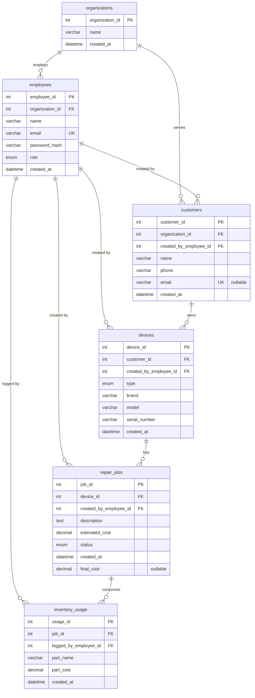
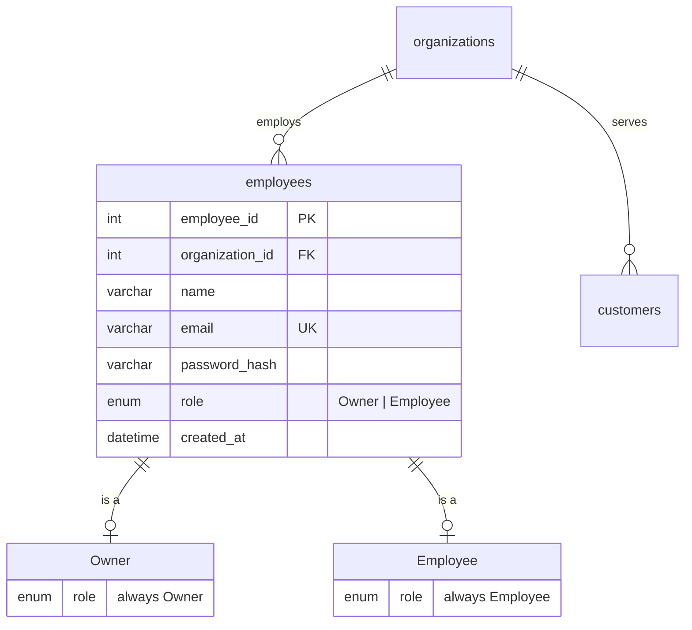
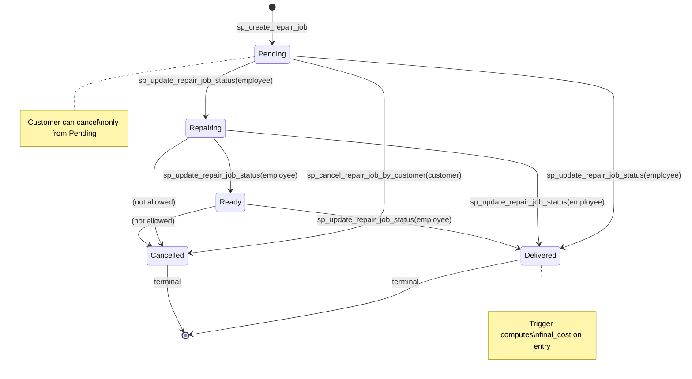
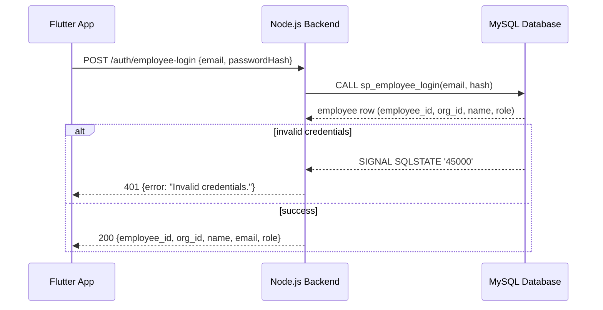
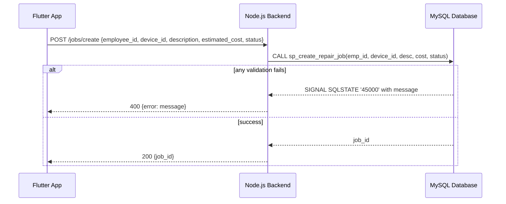
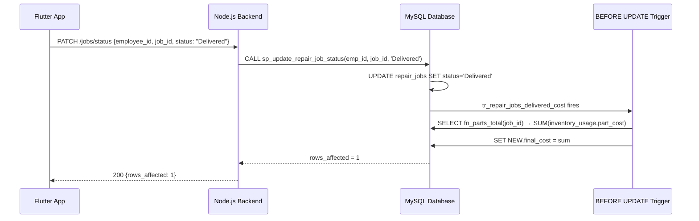
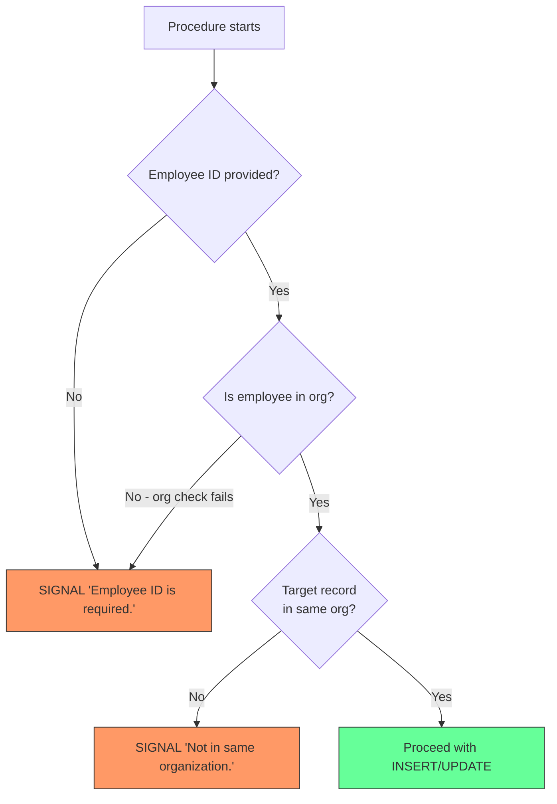

# TechFix Database Documentation

## Table of Contents

1. [Overview](#overview)
2. [Entity Relationship Diagram (ERD)](#entity-relationship-diagram-erd)
3. [Enhanced Entity Relationship Diagram (EERD)](#enhanced-entity-relationship-diagram-eerd)
4. [Status Lifecycle State Machine](#status-lifecycle-state-machine)
5. [Table Specifications](#table-specifications)
   - [organizations](#organizations)
   - [employees](#employees)
   - [customers](#customers)
   - [devices](#devices)
   - [repair_jobs](#repair_jobs)
   - [inventory_usage](#inventory_usage)
6. [Stored Procedure / Function Catalog](#stored-procedure--function-catalog)
   - [Function](#function)
   - [Organization & Employee Setup](#organization--employee-setup)
   - [Authentication](#authentication)
   - [Create Records](#create-records)
   - [Update Records](#update-records)
   - [Read Records](#read-records)
   - [Usage Matrix](#usage-matrix-procedure--table)
7. [Trigger Details](#trigger-details)
8. [Seed Data Walkthrough](#seed-data-walkthrough)
9. [Call Sequence Diagrams](#call-sequence-diagrams)
10. [Frontend ↔ Database Mapping](#frontend--database-mapping)
11. [Key Design Decisions](#key-design-decisions)

---

## Overview

TechFix uses MySQL 8.0+ with InnoDB for transactional integrity, foreign key enforcement, and stored procedure–based data access. All business logic lives in the database layer — the Node.js backend calls stored procedures and never issues raw DML.

**Stack:** MySQL 8.0 | InnoDB | Stored Procedures + Functions | Triggers

**4 execution files (run in order):**

| File | Purpose |
|------|---------|
| `techfix.sql` | Schema — 5 tables with FKs, enums, indexes |
| `techfix_routines.sql` | 1 function + 12 stored procedures |
| `techfix_triggers.sql` | 1 trigger (`tr_repair_jobs_delivered_cost`) |
| `techfix_seed.sql` | Demo data for all 5 tables + inventory usage |

---

## Entity Relationship Diagram (ERD)



---

## Enhanced Entity Relationship Diagram (EERD)

The `employees` table uses a **disjoint (total) specialization** via the `role` column — every employee is exactly one of `Owner` or `Employee`. This is implemented as a single-table (no subclass tables) with an `ENUM` discriminator column.



Since the specialization is **attribute-defined** (no separate sub-tables), constraints are enforced by:
- The `role` `ENUM` at the column level
- The `sp_create_owner` procedure sets `role = 'Owner'`
- The `sp_create_employee` procedure sets `role = 'Employee'`

---

## Status Lifecycle State Machine



**Rules:**
- Employees cannot transition a job to `Cancelled` — that is **customer-only** via `sp_cancel_repair_job_by_customer`
- `Delivered` and `Cancelled` are terminal states — no further updates allowed
- The trigger `tr_repair_jobs_delivered_cost` fires on transition to `Delivered` to auto-calculate `final_cost` via `fn_parts_total`
- Direct transition from `Pending` to `Delivered` is allowed (no parts used → final_cost = 0)

---

## Table Specifications

### `organizations`

| Column | Type | Constraints | Notes |
|--------|------|------------|-------|
| `organization_id` | `INT` | `PK AUTO_INCREMENT` | Surrogate key |
| `name` | `VARCHAR(100)` | `NOT NULL` | Organization display name |
| `created_at` | `DATETIME` | `NOT NULL DEFAULT CURRENT_TIMESTAMP` | Auto-set on insert |

### `employees`

| Column | Type | Constraints | Notes |
|--------|------|------------|-------|
| `employee_id` | `INT` | `PK AUTO_INCREMENT` | Surrogate key |
| `organization_id` | `INT` | `NOT NULL, FK → organizations` | Org membership |
| `name` | `VARCHAR(100)` | `NOT NULL` | Display name |
| `email` | `VARCHAR(100)` | `NOT NULL, UNIQUE` | Login identifier |
| `password_hash` | `VARCHAR(255)` | `NOT NULL` | SHA2-256 hash on client |
| `role` | `ENUM('Owner','Employee')` | `NOT NULL DEFAULT 'Employee'` | Discriminator |
| `created_at` | `DATETIME` | `NOT NULL DEFAULT CURRENT_TIMESTAMP` | Auto-set on insert |

**Indexes:** `uq_employees_email` (UNIQUE on `email`), `fk_employees_org` on `organization_id`

**Delete rule:** `ON DELETE CASCADE` for organization — removing org removes all employees.

### `customers`

| Column | Type | Constraints | Notes |
|--------|------|------------|-------|
| `customer_id` | `INT` | `PK AUTO_INCREMENT` | Surrogate key |
| `organization_id` | `INT` | `NOT NULL, FK → organizations` | Org scope |
| `created_by_employee_id` | `INT` | `NOT NULL, FK → employees` | Who registered the customer |
| `name` | `VARCHAR(100)` | `NOT NULL` | Customer display name |
| `phone` | `VARCHAR(20)` | `NOT NULL` | Contact number |
| `email` | `VARCHAR(100)` | `NULL, UNIQUE` | Nullable — login optional |
| `created_at` | `DATETIME` | `NOT NULL DEFAULT CURRENT_TIMESTAMP` | Auto-set on insert |

**Indexes:** `uq_customers_email` (UNIQUE on `email`), `fk_customers_org` on `organization_id`, `fk_customers_employee` on `created_by_employee_id`

**Delete rule:** `ON DELETE CASCADE` for organization; `ON DELETE RESTRICT` for employee — prevents deleting an employee who registered customers.

### `devices`

| Column | Type | Constraints | Notes |
|--------|------|------------|-------|
| `device_id` | `INT` | `PK AUTO_INCREMENT` | Surrogate key |
| `customer_id` | `INT` | `NOT NULL, FK → customers` | Device owner |
| `created_by_employee_id` | `INT` | `NOT NULL, FK → employees` | Who registered the device |
| `type` | `ENUM('Laptop','Mobile','Console','Tablet','Other')` | `NOT NULL` | Device category |
| `brand` | `VARCHAR(50)` | `NOT NULL` | Manufacturer |
| `model` | `VARCHAR(50)` | `NOT NULL` | Model name/number |
| `serial_number` | `VARCHAR(100)` | `NOT NULL` | Device S/N |
| `created_at` | `DATETIME` | `NOT NULL DEFAULT CURRENT_TIMESTAMP` | Auto-set on insert |

**Indexes:** `fk_devices_customer` on `customer_id`, `fk_devices_employee` on `created_by_employee_id`

**Delete rule:** `ON DELETE CASCADE` for customer; `ON DELETE RESTRICT` for employee.

### `repair_jobs`

| Column | Type | Constraints | Notes |
|--------|------|------------|-------|
| `job_id` | `INT` | `PK AUTO_INCREMENT` | Surrogate key |
| `device_id` | `INT` | `NOT NULL, FK → devices` | Device being repaired |
| `created_by_employee_id` | `INT` | `NOT NULL, FK → employees` | Who created the job |
| `description` | `TEXT` | `NOT NULL` | Issue description |
| `estimated_cost` | `DECIMAL(10,2)` | `NOT NULL DEFAULT 0.00` | Initial estimate |
| `status` | `ENUM('Pending','Repairing','Ready','Delivered','Cancelled')` | `NOT NULL DEFAULT 'Pending'` | Lifecycle state |
| `created_at` | `DATETIME` | `NOT NULL DEFAULT CURRENT_TIMESTAMP` | Auto-set on insert |
| `final_cost` | `DECIMAL(10,2)` | `NULL` | Computed by trigger on Delivered |

**Indexes:** `fk_repair_jobs_device` on `device_id`, `fk_repair_jobs_employee` on `created_by_employee_id`

**Delete rule:** `ON DELETE CASCADE` for device; `ON DELETE RESTRICT` for employee.

### `inventory_usage`

| Column | Type | Constraints | Notes |
|--------|------|------------|-------|
| `usage_id` | `INT` | `PK AUTO_INCREMENT` | Surrogate key |
| `job_id` | `INT` | `NOT NULL, FK → repair_jobs` | Job that used the part |
| `logged_by_employee_id` | `INT` | `NOT NULL, FK → employees` | Who logged the part |
| `part_name` | `VARCHAR(100)` | `NOT NULL` | Part description |
| `part_cost` | `DECIMAL(10,2)` | `NOT NULL DEFAULT 0.00` | Cost of the part |
| `created_at` | `DATETIME` | `NOT NULL DEFAULT CURRENT_TIMESTAMP` | Auto-set on insert |

**Indexes:** `fk_inventory_usage_job` on `job_id`, `fk_inventory_usage_employee` on `logged_by_employee_id`

**Delete rule:** `ON DELETE CASCADE` for repair_jobs; `ON DELETE RESTRICT` for employee.

---

## Stored Procedure / Function Catalog

### Function

| Name | Returns | Purpose |
|------|---------|---------|
| `fn_parts_total(p_job_id)` | `DECIMAL(10,2)` | Sums all `part_cost` for a given job. Used by the Delivered trigger. Deterministic. |

### Organization & Employee Setup

| Procedure | Parameters | Purpose |
|-----------|-----------|---------|
| `sp_create_owner` | `p_org_name`, `p_owner_name`, `p_owner_email`, `p_password_hash` | Transactional: creates org + owner employee in one call. Sets `role = 'Owner'`. |
| `sp_create_employee` | `p_org_id`, `p_name`, `p_email`, `p_password_hash` | Creates an employee. Sets `role = 'Employee'`. Validates org exists. |

### Authentication

| Procedure | Parameters | Purpose |
|-----------|-----------|---------|
| `sp_employee_login` | `p_email`, `p_password_hash` | Validates credentials. Returns employee row (employee_id, organization_id, name, email, role, created_at). Signals `'Invalid credentials.'` on mismatch. Uses case-insensitive collation. |
| `sp_customer_login` | `p_email` | No-password login for customers. Returns customer row. Signals `'Customer not found.'` if email doesn't exist. |

### Create Records

| Procedure | Parameters | Purpose |
|-----------|-----------|---------|
| `sp_create_customer` | `p_org_id`, `p_employee_id`, `p_name`, `p_phone`, `p_email` | Creates customer. If email already exists in same org, returns existing `customer_id` (idempotent via `utf8mb4_unicode_ci`). Otherwise creates new. |
| `sp_create_device` | `p_employee_id`, `p_customer_id`, `p_type`, `p_brand`, `p_model`, `p_serial_number` | Creates device. Validates employee + customer are in the same organization via JOIN. |
| `sp_create_repair_job` | `p_employee_id`, `p_device_id`, `p_description`, `p_estimated_cost`, `p_status` | Creates a repair job. Validates org scope. Normalizes status to `'Pending'` if null/invalid. |
| `sp_log_inventory_usage` | `p_employee_id`, `p_job_id`, `p_part_name`, `p_part_cost` | Logs part usage on a job. Validates org scope through 4-table JOIN (employees → customers → devices → repair_jobs). |

### Update Records

| Procedure | Parameters | Purpose |
|-----------|-----------|---------|
| `sp_update_repair_job_status` | `p_employee_id`, `p_job_id`, `p_status` | Employee-side status transition. Rejects `'Cancelled'` (customer-only). Rejects updates on terminal states (`Delivered`, `Cancelled`). |
| `sp_update_repair_job_description` | `p_employee_id`, `p_job_id`, `p_description` | Updates job description. Rejects updates on cancelled jobs. Validates org scope. |
| `sp_cancel_repair_job_by_customer` | `p_customer_id`, `p_job_id` | Customer-side cancellation. Only allows cancellation from `'Pending'` status. Validates job belongs to customer. |

### Read Records

| Procedure | Parameters | Purpose |
|-----------|-----------|---------|
| `sp_get_repair_jobs` | `p_employee_id`, `p_status`, `p_org_id` | Multi-role: when `p_org_id` is provided (manager view), returns all org jobs. When null (technician view), returns only the employee's jobs. Optional status filter. Joined with devices + customers. |
| `sp_get_customer_full_for_employee` | `p_employee_id`, `p_customer_id` | Returns 4 result sets for an employee's customer view: (1) customer info, (2) devices, (3) repair jobs, (4) inventory usage with employee names. Validates same-org scope. |
| `sp_get_customer_full_for_customer` | `p_email` | Returns 4 result sets for the self-service customer portal: (1) customer info, (2) devices, (3) repair jobs, (4) inventory usage with employee names. No-password access. |

### Usage Matrix (Procedure → Table)

| Procedure | organizations | employees | customers | devices | repair_jobs | inventory_usage |
|-----------|:---:|:---:|:---:|:---:|:---:|:---:|
| `sp_create_owner` | INSERT | INSERT | | | | |
| `sp_create_employee` | | INSERT | | | | |
| `sp_employee_login` | | SELECT | | | | |
| `sp_customer_login` | | | SELECT | | | |
| `sp_create_customer` | | | INSERT/SELECT | | | |
| `sp_create_device` | | | | INSERT | | |
| `sp_create_repair_job` | | | | | INSERT | |
| `sp_log_inventory_usage` | | | | | | INSERT |
| `sp_update_repair_job_status` | | | | | UPDATE | |
| `sp_update_repair_job_description` | | | | | UPDATE | |
| `sp_cancel_repair_job_by_customer` | | | | | UPDATE | |
| `sp_get_repair_jobs` | | | SELECT | SELECT | SELECT | |
| `sp_get_customer_full_for_employee` | | SELECT | SELECT | SELECT | SELECT | SELECT |
| `sp_get_customer_full_for_customer` | | SELECT | SELECT | SELECT | SELECT | SELECT |

---

## Trigger Details

### `tr_repair_jobs_delivered_cost`

- **Timing:** `BEFORE UPDATE` on `repair_jobs`
- **Fires when:** status changes **to** `'Delivered'` (from anything else)
- **Action:** Sets `NEW.final_cost = fn_parts_total(NEW.job_id)`
- **Edge case:** If no parts were logged, `fn_parts_total` returns `0.00` — so `final_cost` will be 0.00 for delivered jobs with no inventory usage

**Flow:**
```
sp_update_repair_job_status(status='Delivered')
  → BEFORE UPDATE trigger fires
  → fn_parts_total(job_id) SUMs inventory_usage.part_cost
  → SET final_cost = the sum
  → UPDATE completes with final_cost populated
```

---

## Seed Data Walkthrough

File: `techfix_seed.sql`

### Organization
- **TechFix Lahore** — single org with organization_id = 1

### Employees (Org 1)
| Name | Email | Role | Password (pre-hashed) |
|------|-------|------|-----------------------|
| Owner Admin | owner@techfix.com | Owner | `SHA2('Owner123', 256)` |
| Bilal Hussain | bilal.tech@techfix.com | Employee | `SHA2('Tech123', 256)` |
| Hira Khan | hira.tech@techfix.com | Employee | `SHA2('Tech123', 256)` |
| Usman Ali | usman.tech@techfix.com | Employee | `SHA2('Tech123', 256)` |

Employee IDs: Owner=1, Bilal=2, Hira=3, Usman=4

### Customers (Org 1)
| Name | Phone | Email | Created By |
|------|-------|-------|------------|
| Ayesha Malik | 03001234567 | ayesha@example.com | Bilal (2) |
| Bilal Ahmed | 03019876543 | bilal@example.com | Hira (3) |
| Sara Iqbal | 03331234567 | sara@example.com | Hira (3) |
| Junaid Ahmad | 03121234567 | junaid@example.com | Usman (4) |
| Mohsin Qureshi | 03211234567 | mohsin@example.com | Usman (4) |

Customer IDs: Ayesha=1, Bilal A=2, Sara=3, Junaid=4, Mohsin=5

### Devices (8 total)
| Customer | Type | Brand | Model | Serial |
|----------|------|-------|-------|--------|
| Bilal A (2) | Laptop | Dell | Inspiron 15 | DL-INSP-001 |
| Bilal A (2) | Mobile | Samsung | Galaxy S20 | SS-S20-002 |
| Bilal A (2) | Console | Sony | PS4 | SN-PS4-003 |
| Bilal A (2) | Laptop | HP | Pavilion | HP-PAV-004 |
| Sara (3) | Mobile | Apple | iPhone 12 | AP-IP12-005 |
| Junaid (4) | Laptop | Lenovo | ThinkPad X1 | LN-TPX1-006 |
| Mohsin (5) | Tablet | Apple | iPad Air | AP-IPAD-007 |
| Mohsin (5) | Mobile | Xiaomi | Mi 11 | XM-MI11-008 |

### Repair Jobs (10 total)
| Created By | Device | Description | Est. Cost | Status |
|-----------|--------|-------------|-----------|--------|
| Bilal (2) | Dell Laptop (1) | Battery drains quickly | 4500 | Pending |
| Bilal (2) | Samsung Mobile (2) | Screen flicker issue | 8000 | Repairing |
| Bilal (2) | Sony Console (3) | HDMI port not working | 6000 | Ready |
| Bilal (2) | HP Laptop (4) | Keyboard keys stuck | 3500 | Pending |
| Hira (3) | iPhone 12 (5) | Camera not focusing | 5000 | Repairing |
| Hira (3) | Lenovo Laptop (6) | Overheating during use | 7000 | Pending |
| Hira (3) | iPad Air (7) | Touch not responding | 6500 | Ready |
| Bilal (2) | Xiaomi Mobile (8) | Charging port loose | 3000 | Pending |
| Bilal (2) | Dell Laptop (1) | Wi-Fi disconnects | 4000 | Ready |
| Bilal (2) | Samsung Mobile (2) | Speaker distortion | 2500 | Repairing |

### Inventory Usage (7 entries)
Used parts across 5 jobs. 3 jobs are transitioned to `Delivered` at the end to demonstrate the trigger computing `final_cost`:

- Job 3 (Sony Console, HDMI) → Delivered, final_cost = 800 (HDMI port)
- Job 7 (iPad Air, Touch) → Delivered, final_cost = 2800 (Touch panel)
- Job 9 (Dell Laptop, Wi-Fi) → Delivered, final_cost = 1200 (Wi-Fi card)

---

## Call Sequence Diagrams

### Employee Login Flow



### Repair Job Creation Flow



### Status Transition with Trigger



### Organization Scope Validation Pattern

All write procedures follow the same org-scope validation pattern via JOIN chains:



---

## Frontend ↔ Database Mapping

| Screen | API Endpoint | Stored Procedure(s) |
|--------|-------------|-------------------|
| Login (Owner/Employee) | `POST /auth/employee-login` | `sp_employee_login` |
| Login (Customer) | `POST /auth/customer-login` | `sp_customer_login` |
| Manager Dashboard | `GET /jobs?org_id=X` | `sp_get_repair_jobs(_, _, org_id)` |
| Technician Dashboard | `GET /jobs?emp_id=X` | `sp_get_repair_jobs(emp_id, _, NULL)` |
| Customer Status | `GET /customer/full?email=X` | `sp_get_customer_full_for_customer` |
| Customer Status (Employee view) | `GET /customer/full?emp_id=X&customer_id=Y` | `sp_get_customer_full_for_employee` |
| Create Customer | `POST /customers` | `sp_create_customer` |
| Create Device | `POST /devices` | `sp_create_device` |
| Create Repair Job | `POST /jobs` | `sp_create_repair_job` |
| Update Job Status | `PATCH /jobs/status` | `sp_update_repair_job_status` |
| Update Job Description | `PATCH /jobs/description` | `sp_update_repair_job_description` |
| Cancel Job (Customer) | `PATCH /jobs/cancel` | `sp_cancel_repair_job_by_customer` |
| Log Inventory Usage | `POST /inventory/usage` | `sp_log_inventory_usage` |
| Add Staff (Manager) | `POST /employees` | `sp_create_employee` |

---

## Key Design Decisions

1. **Stored procedures for all DML** — The Node.js backend never issues `INSERT`, `UPDATE`, or `DELETE` directly. All mutations go through procedures, ensuring consistent validation, org-scope enforcement, and audit trails.

2. **Soft auth for customers** — Customers log in with just an email (no password). This is intentional for the MVP scope: customers access only their own data via `sp_customer_login` and `sp_get_customer_full_for_customer`.

3. **Idempotent customer creation** — `sp_create_customer` checks for existing email within the org and returns the existing `customer_id` instead of throwing a duplicate error. The comparison uses `utf8mb4_unicode_ci` for case-insensitive matching.

4. **Case-insensitive login** — Both `sp_employee_login` and `sp_customer_login` use `utf8mb4_uca1400_ai_ci` collation for email matching, making login case-insensitive.

5. **Terminal state protection** — `Delivered` and `Cancelled` jobs cannot be updated by any procedure. `sp_update_repair_job_status` explicitly checks and rejects these states.

6. **Trigger-based cost calculation** — `final_cost` is not set manually. The `BEFORE UPDATE` trigger on `repair_jobs` computes it automatically when status transitions to `'Delivered'`, using the `fn_parts_total` function.

7. **ON DELETE RESTRICT for employees** — Employees who created customers, devices, repair jobs, or logged inventory usage cannot be deleted. This preserves referential integrity and audit history.
