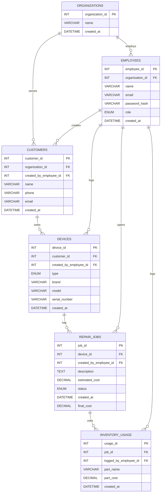

# TechFix ER Diagram

```mermaid
erDiagram
    ORGANIZATIONS {
        INT organization_id PK
        VARCHAR name
        DATETIME created_at
    }

    EMPLOYEES {
        INT employee_id PK
        INT organization_id FK
        VARCHAR name
        VARCHAR email
        VARCHAR password_hash
        ENUM role
        DATETIME created_at
    }

    CUSTOMERS {
        INT customer_id PK
        INT organization_id FK
        INT created_by_employee_id FK
        VARCHAR name
        VARCHAR phone
        VARCHAR email
        DATETIME created_at
    }

    DEVICES {
        INT device_id PK
        INT customer_id FK
        INT created_by_employee_id FK
        ENUM type
        VARCHAR brand
        VARCHAR model
        VARCHAR serial_number
        DATETIME created_at
    }

    REPAIR_JOBS {
        INT job_id PK
        INT device_id FK
        INT created_by_employee_id FK
        TEXT description
        DECIMAL estimated_cost
        ENUM status
        DATETIME created_at
        DECIMAL final_cost
    }

    INVENTORY_USAGE {
        INT usage_id PK
        INT job_id FK
        INT logged_by_employee_id FK
        VARCHAR part_name
        DECIMAL part_cost
        DATETIME created_at
    }

    ORGANIZATIONS ||--o{ EMPLOYEES : employs
    ORGANIZATIONS ||--o{ CUSTOMERS : serves
    EMPLOYEES ||--o{ CUSTOMERS : creates
    CUSTOMERS ||--o{ DEVICES : owns
    EMPLOYEES ||--o{ DEVICES : logs
    DEVICES ||--o{ REPAIR_JOBS : has
    EMPLOYEES ||--o{ REPAIR_JOBS : opens
    REPAIR_JOBS ||--o{ INVENTORY_USAGE : uses
    EMPLOYEES ||--o{ INVENTORY_USAGE : logs
```
