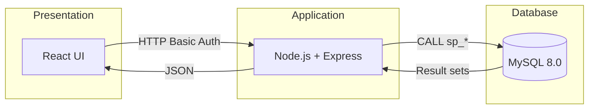
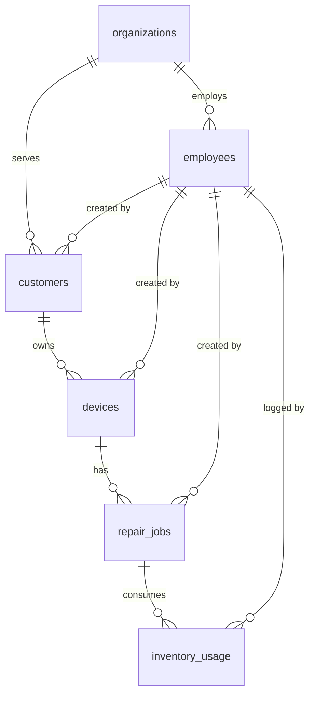
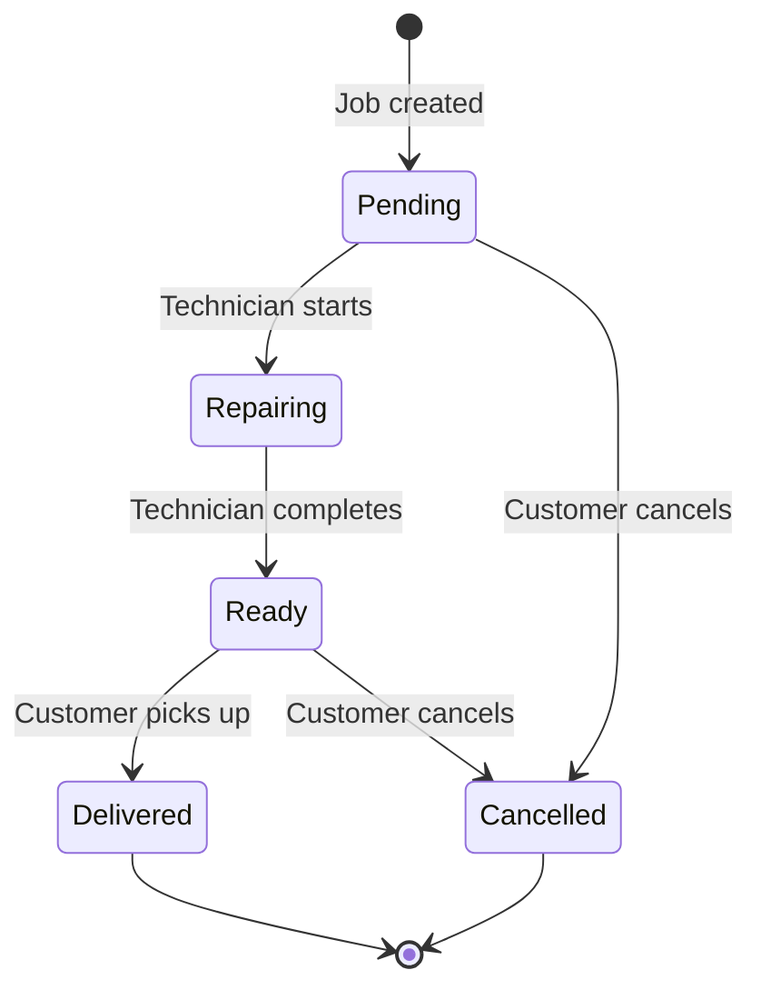
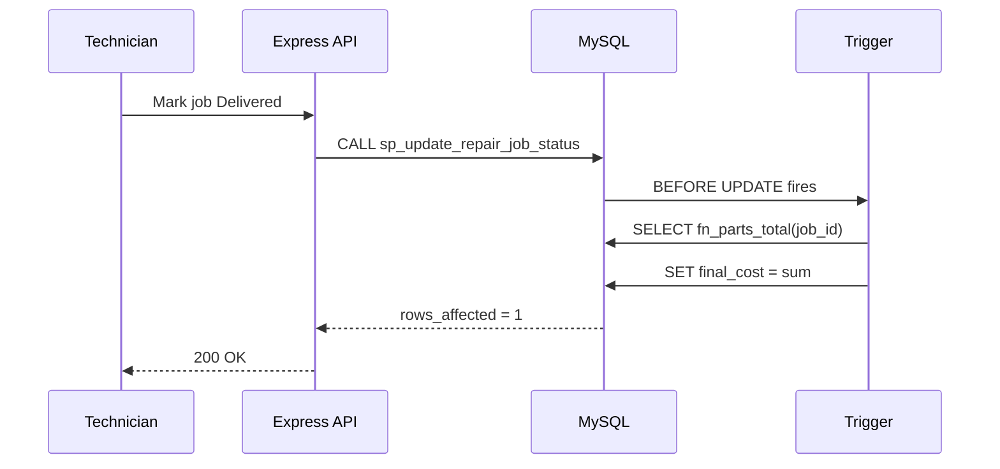
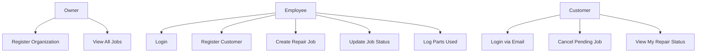
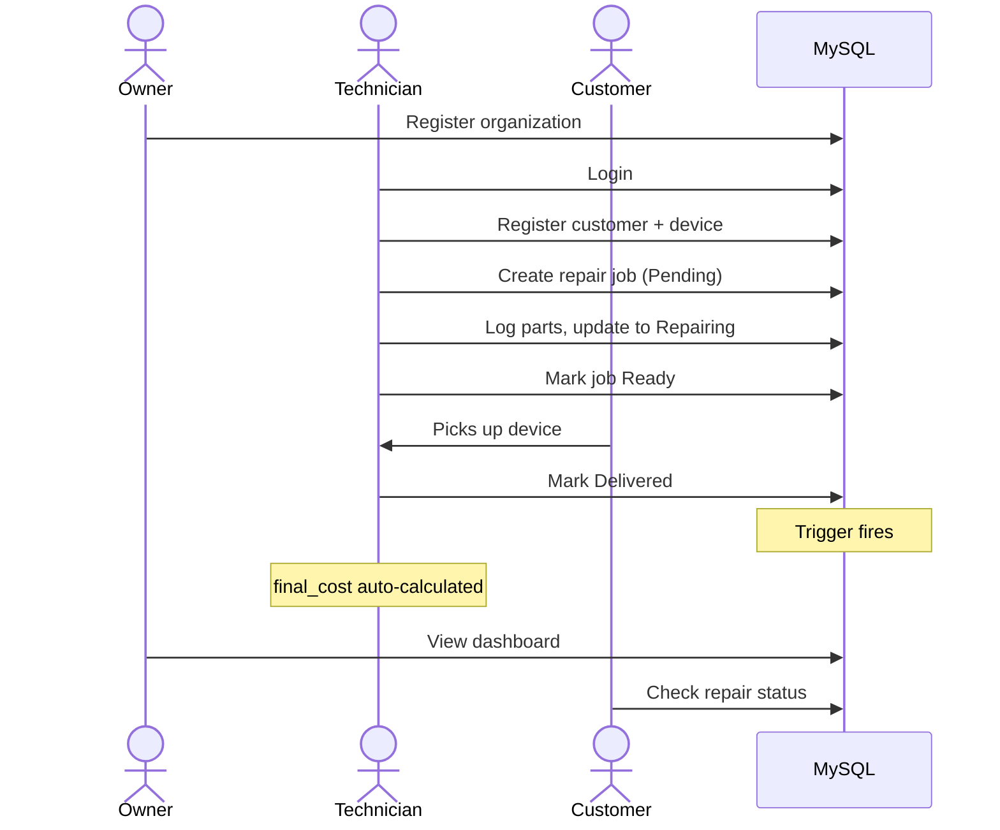

# **TechFix**
## Repair Workflow Management System
DBMS Project — MySQL 8.0 | Node.js + Express | React

---

# Architecture

---

## Introduction

- Centralized platform for electronics repair shops
- Replaces paper job cards and verbal handoffs
- Manages full lifecycle: check-in → repair → delivery
- All business logic in MySQL stored procedures & triggers

---

## Domain Selection

- **Real-world** — repair shops everywhere but under-digitized
- **Rich relationships** — customers, devices, jobs, employees, parts
- **Clear workflow** — strict state machine, ideal for DB enforcement
- **Multi-tenant** — each shop is an isolated organization

---

## Problem Statement

- Lost paper job cards
- No real-time job status
- Manual cost calculations → errors
- No parts tracking
- No customer history

**Solution:** Structured, role-aware database with full audit trail

---

## Novelty — Part 1

- **All logic in stored procedures** — backend never executes raw DML
- **Trigger auto-cost** — sums parts cost automatically on delivery
- **Idempotent creation** — duplicate email returns existing record

---

## Novelty — Part 2

- **Org-scoped tenancy** — all writes validate org membership
- **No-password customer portal** — self-service via email only
- **ENUM specialization** — Owner/Employee via single-table discriminator

---

## Entity Relationship Diagram

6 entities · 9 FK relationships · Normalized 3NF

---

## Status Lifecycle

- Only customers cancel, from **Pending**
- **Delivered / Cancelled** — terminal, no further updates
- Trigger auto-computes `final_cost` on delivery

---

## Entity Overview

| Entity | Key Attributes |
|--------|---------------|
| **organizations** | org_id, name |
| **employees** | emp_id, org_id, name, email, role |
| **customers** | cust_id, org_id, name, phone, email |
| **devices** | device_id, cust_id, type, brand, model, serial |
| **repair_jobs** | job_id, device_id, desc, cost, status |
| **inventory_usage** | usage_id, job_id, part_name, part_cost |

---

## Constraints

| Type | Details |
|------|---------|
| **PKs** | 6 `INT AUTO_INCREMENT` |
| **FKs** | 9 relationships, CASCADE / RESTRICT |
| **UNIQUE** | employee email, customer email |
| **ENUM** | role, device type, job status |
| **CHECK** | Via `SIGNAL` in procedures |

---

## DBMS Features — Data Operations

| Feature | Detail |
|---------|--------|
| **Stored Procedures** | 12 procedures — all DML encapsulated |
| **Functions** | 1 function — `fn_parts_total()` |
| **Triggers** | 1 trigger — auto-cost on Delivered |
| **JOINs** | INNER, LEFT, 4-table chains |

---

## DBMS Features — Programmatic

| Feature | Detail |
|---------|--------|
| **Subqueries** | `EXISTS` for org-scope validation |
| **Transactions** | START TRANSACTION + ROLLBACK |
| **Error Handling** | SIGNAL SQLSTATE '45000' |
| **ENUMs** | Column-level domain enforcement |

---

## Stored Procedures

**12 procedures** across 5 categories:

| Category | Purpose |
|----------|---------|
| **Setup** | Create owner & employee |
| **Auth** | Employee & customer login |
| **Create** | Customer, device, job, inventory |
| **Update** | Job status, description, customer cancel |
| **Read** | Job listing, customer profile |

**Trigger:** `tr_repair_jobs_delivered_cost` auto-sets `final_cost`

---

## Trigger Flow

---

## Use-Cases

All operations are org-scoped — no cross-shop data access.

---

## Sample Results

**Parts Function:** `SELECT fn_parts_total(3)` → **800.00**

**Trigger (Job 9 → Delivered):**
| | status | final_cost |
|--|--------|-----------|
| Before | Ready | NULL |
| After | Delivered | 1200.00 |

**Customer profile:** email login returns 4 result sets — info, devices, jobs, parts

---

## Workflow

---

## Conclusion

- Normalized 3NF schema — 6 entities, full referential integrity
- 12 stored procedures + 1 function + 1 trigger
- Automated cost calculation, no manual entry
- Multi-tenant org-scoped isolation
- Role-aware access: Owner, Employee, Customer
- **Database as authoritative data layer** — consistent across any client
