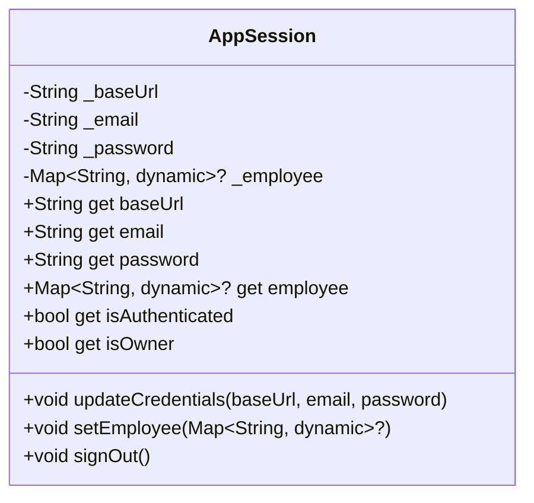
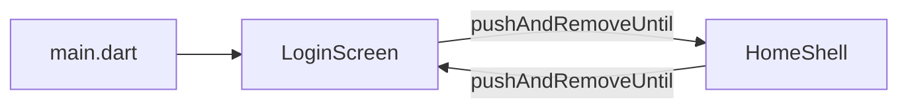
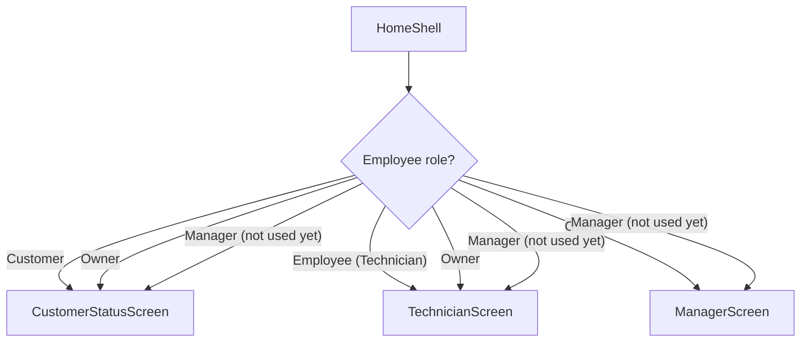

# TechFix Frontend — Flutter Application

> Flutter 3.x mobile/desktop UI consuming the TechFix Express backend API via HTTP Basic Auth.

---

## Table of Contents

1. [Project Structure](#project-structure)
2. [App Entry Point & Boot Sequence](#app-entry-point--boot-sequence)
3. [State Management](#state-management)
4. [Navigation & Routing](#navigation--routing)
5. [Screen-by-Screen Breakdown](#screen-by-screen-breakdown)
   - [Login Screen](#login-screen)
   - [Home Shell](#home-shell)
   - [Customer Status Screen](#customer-status-screen)
   - [Technician Screen](#technician-screen)
   - [Manager Screen](#manager-screen)
6. [Dialog & Sheet Extraction](#dialog--sheet-extraction)
7. [Shared Widget Reference](#shared-widget-reference)
8. [API Service Layer](#api-service-layer)
9. [Design System & Theme](#design-system--theme)
10. [Shared Utilities](#shared-utilities)
11. [Input Validation](#input-validation)
12. [Toast System](#toast-system)
13. [File Inventory](#file-inventory)

---

## Project Structure

```
lib/
├── main.dart                        # App entry point, AppSession creation
├── config/
│   └── api_config.dart              # Base URL constants per platform
├── models/
│   ├── repair_job.dart              # RepairJob data class (fromApi factory)
│   └── inventory_usage.dart         # InventoryUsage data class
├── screens/
│   ├── login_screen.dart            # 3-tab auth (779 lines)
│   ├── home_shell.dart              # IndexedStack + NavigationBar (106 lines)
│   ├── customer_status_screen.dart  # Customer self-service (686 lines)
│   ├── technician_screen.dart       # Technician job list (470 lines)
│   ├── technician/
│   │   ├── status_radio_dialog.dart # Status change radio selector (99 lines)
│   │   ├── edit_desc_dialog.dart    # Edit job description + cost (76 lines)
│   │   ├── create_job_sheet.dart    # 3-step job creation sheet (306 lines)
│   │   └── log_part_sheet.dart      # Log part usage sheet (152 lines)
│   ├── manager_screen.dart          # Manager dashboard (438 lines)
│   └── manager/
│       ├── add_staff_dialog.dart    # Add technician dialog (109 lines)
│       └── donut_painter.dart       # CustomPaint donut chart (74 lines)
├── services/
│   └── techfix_api.dart             # REST client, all endpoints (350 lines)
├── shared/
│   └── utils.dart                   # signOut(), fmtMoney(), regex, constant
├── state/
│   ├── app_session.dart             # ChangeNotifier — credentials, auth (42 lines)
│   └── app_session_scope.dart       # InheritedNotifier accessor (16 lines)
├── theme/
│   └── app_theme.dart               # Design tokens, ColorScheme, TextTheme (127 lines)
└── widgets/                         # 15 reusable widgets (~1,450 lines total)
    ├── app_background.dart          # S
    ├── avatar.dart                  # C
    ├── empty_state.dart             # S
    ├── error_state.dart             # S
    ├── field.dart                   # S
    ├── filter_chip.dart             # S
    ├── job_card.dart                # S
    ├── loading_state.dart           # S
    ├── pill.dart                    # S
    ├── section_header.dart          # S
    ├── sheet.dart                   # S
    ├── stat_card.dart               # S
    ├── status_badge.dart            # S
    ├── techfix_dialog.dart          # S
    └── toast.dart                   # S

Legend: S=shared, C=customer-only
```

---

## App Entry Point & Boot Sequence

```dart
// main.dart — simplified
void main() => runApp(const TechFixApp());

class TechFixApp extends StatefulWidget {
  State<TechFixApp> createState() => _TechFixAppState();
}

class _TechFixAppState extends State<TechFixApp> {
  late final AppSession _session;

  void initState() {
    _session = AppSession(baseUrl: ApiConfig.chromeBaseUrl);
  }

  Widget build(BuildContext context) {
    return AppSessionScope(
      session: _session,
      child: MaterialApp(
        theme: AppTheme.lightTheme,
        home: const LoginScreen(),
      ),
    );
  }
}
```

**Boot sequence:**
1. `main()` calls `runApp` with `TechFixApp`
2. `TechFixApp` creates `AppSession` with the Chrome base URL (stored in `ApiConfig`)
3. Wraps the entire app in `AppSessionScope` (an `InheritedNotifier`) — all descendants can access session via `AppSessionScope.of(context)`
4. `MaterialApp` is configured with `AppTheme.lightTheme` (Material 3, `Space Grotesk` font, coral primary)
5. Initial route is `LoginScreen`

---

## State Management

### AppSession (ChangeNotifier)



- Created once in `main.dart` and injected via `AppSessionScope`
- `updateCredentials()` — called during login after successful auth; stores the credentials that will be used for all subsequent API calls
- `setEmployee()` — called after login to store the employee/customer data
- `signOut()` — clears employee data, triggering UI rebuild that returns to `LoginScreen`
- `isOwner` getter checks `employee?['role'] == 'Owner'`

### AppSessionScope (InheritedNotifier)

```dart
class AppSessionScope extends InheritedNotifier<AppSession> {
  static AppSession of(BuildContext context) {
    final scope = context.dependOnInheritedWidgetOfExactType<AppSessionScope>();
    return scope!.notifier!;
  }
}
```

- Wraps `AppSession` as an `InheritedNotifier` — any widget that calls `AppSessionScope.of(context)` rebuilds when the `AppSession` notifies listeners
- Used by every screen to access credentials and employee data

---

## Navigation & Routing

No Flutter Navigator routes are defined. The app uses a simple two-screen stack:

1. **LoginScreen** — shown initially. On successful authentication, `pushAndRemoveUntil` replaces the entire stack with `HomeShell`.
2. **HomeShell** — contains an `IndexedStack` with a `NavigationBar`. On sign out, `pushAndRemoveUntil` replaces the stack back to `LoginScreen`.



### HomeShell — Role-Based Tab Filtering



Three tabs defined in `_allNavItems`:

| Tab | Screen | Icon | Roles |
|-----|--------|------|-------|
| Customer | `CustomerStatusScreen` | `receipt_long` | Customer, Manager |
| Technician | `TechnicianScreen` | `build_circle_outlined` | Employee, Manager |
| Manager | `ManagerScreen` | `dashboard_outlined` | Owner, Manager |

- Tabs are filtered at build time via `_getVisibleTabs()` — only tabs matching the employee's role are shown
- If only 1 tab is visible, `NavigationBar` is hidden (only `IndexedStack` is shown)
- `index` is clamped to available tabs to prevent out-of-range errors

---

## Screen-by-Screen Breakdown

### Login Screen

**File:** `lib/screens/login_screen.dart` — 779 lines

**State:** `_LoginScreenState` — manages 3 form keys, 8 controllers, auth mode toggles.

**Modes:** `AuthMode.owner`, `AuthMode.employee`, `AuthMode.customer`

**Owner sub-mode:** `OwnerMode.signIn` / `OwnerMode.signUp`

**Dependencies:** `AppBackground`, `Field`, `Toast`, `Brandmark`, `AppTheme`, `TechFixApi`, `AppSessionScope`

**Layout (by mode):**

```
┌──────────────────────────────────┐
│        Brandmark (icon)          │
│       "TechFix" title            │
│                                  │
│   [Owner] [Employee] [Customer]  │  <- SegmentedButton
│                                  │
│   ┌── Owner mode ──────────────┐ │
│   │  [Sign In] [Sign Up]       │ │  <- OwnerMode toggle
│   │                            │ │
│   │  (Sign In form):           │ │
│   │  Email field               │ │
│   │  Password field            │ │
│   │  [Sign In] button          │ │
│   │                            │ │
│   │  (Sign Up form):           │ │
│   │  Org name field            │ │
│   │  Owner name field          │ │
│   │  Email field               │ │
│   │  Password field            │ │
│   │  Base URL field            │ │
│   │  [Sign Up] button          │ │
│   └────────────────────────────┘ │
│                                  │
│   ┌── Employee mode ───────────┐ │
│   │  Email field               │ │
│   │  Password field            │ │
│   │  [Sign In] button          │ │
│   └────────────────────────────┘ │
│                                  │
│   ┌── Customer mode ───────────┐ │
│   │  Email field               │ │
│   │  [Sign In] button          │ │
│   └────────────────────────────┘ │
└──────────────────────────────────┘
```

**Auth flow:**
1. User fills credentials, taps Sign In (or Enter key via `onSubmitted`)
2. Client-side validation: email regex, password required/min-length, field checks
3. `_authenticateAndGo()` creates a `TechFixApi` instance, calls the appropriate login procedure
4. On success: `updateCredentials()` + `setEmployee()` on the session, then `pushAndRemoveUntil` to `HomeShell`
5. **Role check for Owner:** `_authenticateAndGo` accepts a `requiredRole` parameter. Owner Sign In passes `requiredRole: 'Owner'`. If the returned employee `role` is not `'Owner'`, the login is rejected with `"Access denied: not a Owner account."`
6. On error: `showToast(context, 'Error: $e', type: ToastType.error)`

**Owner Sign Up flow:**
1. Fields: org name, owner name, email, password, base URL
2. Calls `TechFixApi.createOwner()` → `POST /api/employees/owner`
3. On success: auto-authenticates using the new credentials, navigates to `HomeShell`

**Validation getters:**
- `_ownerSignInValid` — email and password both non-empty
- `_ownerSignUpValid` — all 4 fields non-empty, email matches regex
- `_employeeValid` — email and password both non-empty
- `_customerValid` — email non-empty

---

### Home Shell

**File:** `lib/screens/home_shell.dart` — 106 lines

**State:** `_HomeShellState` — manages `_index` (current tab index)

**Structure:**
```dart
Scaffold(
  body: IndexedStack(index: currentIndex, children: visibleTabs.map((item) => item.screen)),
  bottomNavigationBar: visibleTabs.length >= 2 ? NavigationBar(...) : null,
)
```

- `_NavItem` class holds: `screen`, `icon`, `label`, `roles` (list of allowed role strings)
- Tab filter logic: `_allNavItems.where((item) => item.roles.contains(role))`
- Sign out via `TextButton` in each screen's AppBar calls `signOut(context)` from `shared/utils.dart`

---

### Customer Status Screen

**File:** `lib/screens/customer_status_screen.dart` — 686 lines

**State:** `_CustomerStatusScreenState` — async loads customer data on init

**Build structure** (split into 7 private methods):

| Method | Lines | Renders |
|--------|-------|---------|
| `_buildHeader()` | 50 | Profile card: `Avatar` + name, phone, member `Pill` |
| `_buildSearchBar()` | 40 | Search field with debounce-like clear behavior |
| `_buildContent()` | 8 | Routes to stats or profiles based on search |
| `_buildProfileCard()` | 60 | Customer profile with icon, name, email, phone |
| `_buildStats()` | 30 | `SectionHeader` + `StatCard` grid (total devices, jobs, etc.) |
| `_buildDeviceSection()` | 70 | List of device cards with `StatusBadge`, tap to show jobs |
| (inline) `_showDeviceJobsDialog()` | 90 | `showGeneralDialog` — device repair jobs with cancel |

**Data loading:**
- Customer: calls `TechFixApi.getCustomerSelf()` → `GET /api/customers/me`
- Employee (Manager): calls `TechFixApi.getCustomerFull()` → `GET /api/customers/:id`
- Both populate `_customerData`, `_devices`, `_jobs`, `_usages` from the response

**States:** `ConnectionState.waiting` → `LoadingState` | error → `ErrorState` | empty → `EmptyState` | data → content

---

### Technician Screen

**File:** `lib/screens/technician_screen.dart` — 470 lines

**State:** `_TechnicianScreenState` — `_jobsFuture`, `_searchQuery`, `_filter`, `_dialogType`, `_dialogJob`

**Key data flow:**
```dart
_loadJobs() → TechFixApi.getRepairJobs()  // employee-scoped (no org_id)
_fetchUsagesForJobs() → TechFixApi.fetchUsagesForJobs()  // per-job inventory usage
```

**Dialog/Sheet orchestration pattern:**
```dart
// Dialog type + optional job are stored in state
String? _dialogType;       // 'create' | 'logpart' | 'status' | 'edit'
RepairJob? _dialogJob;     // non-null for 'status' and 'edit'

// Rendered as overlay widgets in Stack:
if (_dialogType == 'status' && _dialogJob != null) StatusRadioDialog(...)
if (_dialogType == 'edit' && _dialogJob != null)   EditDescDialog(...)
if (_dialogType == 'create')                        CreateJobSheet(...)
if (_dialogType == 'logpart')                       LogPartSheet(...)
```

**Layout:**
```
┌─ AppBar: "Technician" [Inventory icon] [Sign out] ─┐
│                                                      │
│  [🔍 Search device, customer, #id, status...]        │
│                                                      │
│  [All 5] [Pending 3] [Repairing 2]                   │  <- FilterChipWidget
│                                                      │
│  ┌── JobCard ──────────────────────────────────────┐ │
│  │  #123  Dell Inspiron 15   Pending  🔵            │ │
│  │  Ayesha Malik · 0300XXXXXXX                      │ │
│  │  Est: $4,500                                     │ │
│  │  ─────────────────────                           │ │
│  │  Battery drains quickly                           │ │
│  │  [Edit] [Status]                                  │ │
│  └──────────────────────────────────────────────────┘ │
│                                                      │
│              [➕ Create job] FAB                       │
└──────────────────────────────────────────────────────┘
```

**Filtering:**
- Shows only `Pending` and `Repairing` jobs (technician scope)
- Filter chips: All | Pending | Repairing
- Search bar filters by device label, customer name, job ID, status

---

### Manager Screen

**File:** `lib/screens/manager_screen.dart` — 438 lines

**State:** `_ManagerScreenState` — loads all org jobs, computes KPIs

**Layout:**
```
┌─ AppBar: "Manager" [Sign out] ──────────────────────┐
│                                                       │
│  ┌── Donut Chart ──────────────────────────────────┐ │
│  │     ╭──────╮                                    │ │
│  │    ╱  ╭───╮ ╲                                   │ │
│  │   │  │4  │  │  Status distribution               │ │
│  │   │  │   │  │  ● Pending (40%)                    │ │
│  │    ╲  ╰───╯ ╱   ● Repairing (30%)                │ │
│  │     ╰──────╯    ● Ready (20%)                    │ │
│  │                  ● Delivered (10%)                │ │
│  └──────────────────────────────────────────────────┘ │
│                                                       │
│  ┌── Revenue Card ─────────────────────────────────┐ │
│  │  Revenue     Target: $50,000                     │ │
│  │  ████████████░░░░░░░░░░  $24,500 / $50,000      │ │
│  │  Finalized: $12,350  Est.: $12,150               │ │
│  └──────────────────────────────────────────────────┘ │
│                                                       │
│  ┌── SectionHeader: "Recent Jobs" ─────────────────┐ │
│  │                                                   │ │
│  │  ┌── JobCard ──────────────────────────────────┐ │ │
│  │  │  #45   Dell Inspiron    Delivered ✅         │ │ │
│  │  │  Ayesha · 0300XXXXXXX                        │ │ │
│  │  │  Final: $3,200  [Usage: Battery pack]        │ │ │
│  │  └──────────────────────────────────────────────┘ │ │
│  │  ┌── JobCard ... ───────────────────────────────┐ │ │
│  │  ...                                            │ │ │
│  │  └──────────────────────────────────────────────┘ │ │
│  │  [Show more]                                      │ │
│  └───────────────────────────────────────────────────┘ │
│                                                       │
│  FAB: [➕ Add staff]                                    │
└───────────────────────────────────────────────────────┘
```

**KPIs computed from job data:**
- **Active jobs** — count of status != Delivered/Cancelled
- **Revenue** — finalized = sum of `final_cost` where status=Delivered; estimated = sum of `estimated_cost` where status≠Delivered/Cancelled
- **Donut chart** — `CustomPainter` (`DonutPainter`) draws arcs for each status count with color-coded segments + `LegendDot` labels
- **Progress bar** — dual-bar showing finalized vs estimated toward target

**Dialogs:** `AddStaffDialog` — form with name, email, password fields + validation

---

## Dialog & Sheet Extraction

### Pattern

Each dialog/sheet extracted from `technician_screen.dart` follows this contract:

```dart
// Dialog — wrapped in TechFixDialog shell
class StatusRadioDialog extends StatefulWidget {
  final RepairJob job;
  final VoidCallback onClose;
  final ValueChanged<String> onSave;  // returns status string
}

// Sheet — wrapped in Sheet shell
class CreateJobSheet extends StatefulWidget {
  final VoidCallback onClose;
  final ValueChanged<Map<String, String>> onCreate;  // returns form data
}
```

### Files

| File | Shell | Props | Purpose |
|------|-------|-------|---------|
| `status_radio_dialog.dart` | `TechFixDialog` | `job`, `onClose`, `onSave(status)` | Radio list of valid status transitions. Disabled options for blocked transitions. |
| `edit_desc_dialog.dart` | `TechFixDialog` | `job`, `onClose`, `onSave(patch)` | Two `Field` widgets: description (multiline) + estimated cost |
| `create_job_sheet.dart` | `Sheet` | `onClose`, `onCreate(form)` | 3-step form: Step 1 (customer email/name/phone), Step 2 (device type/brand/model/serial), Step 3 (description/cost) with stepper indicator |
| `log_part_sheet.dart` | `Sheet` | `jobs`, `onClose`, `onLog(part)` | Radio list of jobs + part name/cost fields |
| `add_staff_dialog.dart` | `TechFixDialog` | `onClose`, `onSave(form)` | Name, email, password fields with validation |

### Extraction Decision

| Why extracted | Why kept inline |
|---------------|-----------------|
| `StatusRadioDialog` — reusable status selector | `_showDeviceJobsDialog` in customer screen — references 3 private helpers (`_deviceIconData`, `_deviceLabel`, `_cancelJob`) |
| `EditDescDialog` — reusable edit form | |
| `CreateJobSheet` — 306 lines, complex 3-step | |
| `LogPartSheet` — 152 lines, distinct purpose | |
| `AddStaffDialog` — manager-only feature | |
| `DonutPainter` — reusable CustomPainter | |

---

## Shared Widget Reference

### Widget Gallery

| Widget | File | Props | Used By |
|--------|------|-------|---------|
| **AppBackground** | `app_background.dart` | `child` | All screens |
| **Avatar** | `avatar.dart` | `name`, `size` (optional, default 56) | Customer screen |
| **EmptyState** | `empty_state.dart` | `icon`, `title`, `body`, `actionLabel?`, `onAction?`, `color?` | All screens |
| **ErrorState** | `error_state.dart` | `body`, `onRetry` | All screens |
| **Field** | `field.dart` | `controller`, `hint`, `obscureText?`, `keyboardType?`, `validator?`, `textInputAction?`, `onSubmitted?` | Login, all dialogs/sheets |
| **FilterChipWidget** | `filter_chip.dart` | `label`, `count?`, `active`, `color`, `onTap` | Technician screen |
| **JobCard** | `job_card.dart` | `job`, `usages?`, `onStatusTap?`, `onEdit?`, `onCancel?` | Technician, Manager |
| **LoadingState** | `loading_state.dart` | `count?` (skeleton cards) | All screens |
| **Pill** | `pill.dart` | `label`, `color` | Customer screen (member since) |
| **SectionHeader** | `section_header.dart` | `title`, `action?` | Customer, Manager |
| **Sheet** | `sheet.dart` | `title`, `children`, `onClose` | CreateJobSheet, LogPartSheet |
| **StatCard** | `stat_card.dart` | `icon`, `label`, `value`, `color`, `invert?` | Customer, Manager |
| **StatusBadge** | `status_badge.dart` | `status`, `small?` | Customer (device jobs) |
| **TechFixDialog** | `techfix_dialog.dart` | `title`, `children`, `onClose` | StatusRadio, EditDesc, AddStaff |
| **Toast** | `toast.dart` | `showToast(context, msg, type?)` | All screens (utility, not a widget) |

### Widget Hierarchy

```mermaid
graph TB
    subgraph "Shared Widgets"
        AB[AppBackground]
        AV[Avatar]
        ES[EmptyState]
        ER[ErrorState]
        FD[Field]
        FC[FilterChipWidget]
        JC[JobCard]
        LS[LoadingState]
        PL[Pill]
        SH[SectionHeader]
        ST[Sheet]
        SC[StatCard]
        SB[StatusBadge]
        TD[TechFixDialog]
        TST[Toast utility]
    end

    subgraph "Screen Usage"
        LSG[LoginScreen]
        TSG[TechnicianScreen]
        MSG[ManagerScreen]
        CSG[CustomerStatusScreen]
    end

    LSG --> AB & FD & TST
    TSG --> AB & FC & JC & LS & ES & ER & TST
    MSG --> AB & JC & LS & ES & ER & TST & SH & SC
    CSG --> AB & AV & PL & SB & SC & SH & LS & ES & ER & TST

    subgraph "Dialog/Sheet Usage"
        SRD[StatusRadioDialog] --> TD
        EDD[EditDescDialog] --> TD & FD
        ASD[AddStaffDialog] --> TD & FD
        CJS[CreateJobSheet] --> ST & FD
        LPS[LogPartSheet] --> ST & FD
    end
```



---

## API Service Layer

**File:** `lib/services/techfix_api.dart` — 350 lines

**Class:** `TechFixApi`

**Constructor:**
```dart
TechFixApi({required String baseUrl, required String email, required String password})
```

**Auth headers** — computed on each request via `_headers` getter:
```dart
Map<String, String> get _headers {
  final auth = base64Encode(utf8.encode('$email:$password'));
  return {'Authorization': 'Basic $auth', 'Content-Type': 'application/json'};
}
```

### Endpoint Methods

| Method | HTTP | Endpoint | Returns |
|--------|------|----------|---------|
| `employeeLogin()` | POST | `/api/auth/employee` | `Map<String, dynamic>` — employee data |
| `customerLogin()` | POST | `/api/auth/customer` | `Map<String, dynamic>` — customer data |
| `createOwner()` | POST | `/api/employees/owner` | `Map<String, dynamic>` — org + owner IDs |
| `createEmployee()` | POST | `/api/employees` | `Map<String, dynamic>` — employee ID |
| `createCustomer()` | POST | `/api/customers` | `int` — customer ID |
| `getCustomerSelf()` | GET | `/api/customers/me` | `Map<String, dynamic>` — 4 result sets |
| `getCustomerFull()` | GET | `/api/customers/:id` | `Map<String, dynamic>` — 4 result sets |
| `createDevice()` | POST | `/api/devices` | `int` — device ID |
| `getRepairJobs()` | GET | `/api/repair-jobs?org_id=X` | `List<Map<String, dynamic>>` — jobs |
| `createRepairJob()` | POST | `/api/repair-jobs` | `int` — job ID |
| `updateRepairJobStatus()` | PUT | `/api/repair-jobs/:id` | `Map<String, dynamic>` |
| `updateJobDescription()` | PUT | `/api/repair-jobs/:id/description` | `Map<String, dynamic>` |
| `cancelRepairJob()` | POST | `/api/repair-jobs/:id/cancel` | `Map<String, dynamic>` |
| `logPartUsage()` | POST | `/api/inventory-usage` | `int` — usage ID |
| `fetchUsagesForJobs()` (static) | GET | `/api/customers/:id` per job | `Map<int, List<InventoryUsage>>` |

**Error handling:** `_getErrorMessage()` parses the response body for `message` or `error` field and prefixes with status code.

**Usage pattern:**
```dart
final session = AppSessionScope.of(context);
final api = TechFixApi(baseUrl: session.baseUrl, email: session.email, password: session.password);
final result = await api.getRepairJobs();
```

---

## Design System & Theme

### Color Tokens

| Token | Hex | Intent |
|-------|-----|--------|
| **Coral** | `#F26B4A` | Primary (buttons, FAB, active states, Owner mode) |
| **Teal** | `#2A9D8F` | Success, Employee mode accent |
| **Sky** | `#2D7BD1` | Info, Customer mode accent |
| **Clay** | `#B86B4B` | Inventory actions |
| **Ink** | `#141414` | Text, icons |
| **Cream** | `#F7F3ED` | Subtle background, screen fill |
| **Beige** | `#EFE7DA` | Card backgrounds |
| **Grey** | `#9A958C` | Muted text |

### Derived Tokens

| Token | Opacity | Usage |
|-------|---------|-------|
| **line** | 8% ink (0x14) | Borders |
| **line2** | 14% ink (0x24) | Light borders, search bar border |
| **muted** | 55% ink (0x8C) | Secondary text |
| **faint** | 38% ink (0x61) | Placeholder, tertiary text |

### Status Color Helpers

```dart
static Color statusColor(String status)   // Pending=Clay, Repairing=Sky, Ready=Teal, Delivered=Teal, Cancelled=Grey
static Color statusBg(String status)     // 12% opacity of status color
static Color statusIcon(String status)   // Icon associated with each status
static String statusLabel(String status) // Capitalized label
```

### Text Theme

- `GoogleFonts.spaceGroteskTextTheme()` — registered at the theme level
- No `fontFamily` is hardcoded on individual `TextStyle`s — the `ThemeData.fontFamily` provides the default
- Material 3 `ColorScheme.light` with `primary: coral`, `secondary: teal`

---

## Shared Utilities

**File:** `lib/shared/utils.dart` — 17 lines

```dart
const emailRegex = r'^[^@\s]+@[^@\s]+\.[^@\s]+$';
const minPasswordLength = 6;

void signOut(BuildContext context) {
  final session = AppSessionScope.of(context);
  session.signOut();
  Navigator.of(context).pushAndRemoveUntil(
    MaterialPageRoute(builder: (_) => const LoginScreen()),
    (_) => false,
  );
}

String fmtMoney(double n) => '\$${n.toStringAsFixed(2)}';
```

**Usage across the app:**
- `signOut(context)` — called from Technician, Manager, and Customer screens' AppBar
- `fmtMoney(amount)` — formats estimated/final costs and revenue displays
- `emailRegex` — used in login validation and all dialog form validation
- `minPasswordLength` — minimum password requirement (6) used in Owner Sign Up and AddStaffDialog

---

## Input Validation

### Validation patterns used across all forms:

| Field | Check | Error message |
|-------|-------|---------------|
| Email | RegExp `emailRegex` | `'Enter a valid email'` |
| Password | `isNotEmpty` + `length >= minPasswordLength` | `'Password is required'` / `'Password too short'` |
| Name | `isNotEmpty` | `'Name is required'` |
| Phone | `isNotEmpty` | `'Phone is required'` |
| Cost (estimated/part) | `double.tryParse(value) != null` | Parsing error / zero fallback |
| Serial number | `isNotEmpty` (optional in forms) | N/A fallback to `'N/A'` |
| Org name | `isNotEmpty` | `'Organization name is required'` |

### Keyboard Types

| Field | Keyboard Type |
|-------|---------------|
| Email | `TextInputType.emailAddress` |
| Phone | `TextInputType.phone` |
| Cost | `TextInputType.number` |
| Password | default (with `obscureText: true`) |

### Submit-on-Enter

All Login screen fields use `textInputAction: TextInputAction.next` except the last field in each form, which uses `TextInputAction.done` and triggers `onSubmitted` → submit function.

---

## Toast System

**File:** `lib/widgets/toast.dart`

**Function:**
```dart
showToast(BuildContext context, String message, {ToastType type = ToastType.success});
```

**Behavior:**
- Floating snackbar at the bottom with rounded corners
- Dark (`Ink`) background for success, Coral background for errors
- Disappears after 2.5 seconds
- Uses the current `ScaffoldMessenger` to display

**Usage pattern:**
```dart
// Success toast
showToast(context, 'Job created!');

// Error toast
showToast(context, 'Error: ${e}', type: ToastType.error);
```

**Replaces** raw `ScaffoldMessenger.of(context).showSnackBar(...)` calls everywhere. Previously 12+ raw calls, now all use `showToast`.

---

## File Inventory

| Directory | File | Lines | Responsibility |
|-----------|------|-------|----------------|
| **root** | `main.dart` | 39 | Entry point, `AppSession`, `MaterialApp` |
| **config/** | `api_config.dart` | 5 | Base URL per platform |
| **models/** | `repair_job.dart` | 69 | `RepairJob` — `id`, `deviceId`, `customerName`, `deviceLabel`, `description`, `estimatedCost`, `finalCost`, `status`, `createdAt`, `customerPhone` |
| | `inventory_usage.dart` | 33 | `InventoryUsage` — `usageId`, `jobId`, `partName`, `partCost`, `createdAt`, `employeeName` |
| **screens/** | `login_screen.dart` | 779 | 3-tab auth, Owner Sign In/Up toggle |
| | `home_shell.dart` | 106 | `IndexedStack` + role-filtered tabs |
| | `customer_status_screen.dart` | 686 | Self-service customer portal |
| | `technician_screen.dart` | 470 | Job list with search/filter, overlay dialog orchestration |
| | `technician/status_radio_dialog.dart` | 99 | Status radio picker in `TechFixDialog` |
| | `technician/edit_desc_dialog.dart` | 76 | Edit description + cost in `TechFixDialog` |
| | `technician/create_job_sheet.dart` | 306 | 3-step create job in `Sheet` |
| | `technician/log_part_sheet.dart` | 152 | Log part in `Sheet` |
| | `manager_screen.dart` | 438 | Dashboard with donut, revenue, jobs |
| | `manager/add_staff_dialog.dart` | 109 | Add staff in `TechFixDialog` |
| | `manager/donut_painter.dart` | 74 | `DonutPainter` `CustomPainter` + `LegendDot` |
| **services/** | `techfix_api.dart` | 350 | REST client, all 15 endpoint methods |
| **shared/** | `utils.dart` | 17 | `signOut()`, `fmtMoney()`, `emailRegex`, `minPasswordLength` |
| **state/** | `app_session.dart` | 42 | `ChangeNotifier` — credentials, employee, `isOwner` |
| | `app_session_scope.dart` | 16 | `InheritedNotifier` — scoped session access |
| **theme/** | `app_theme.dart` | 127 | Color tokens, status helpers, `TextTheme` |
| **widgets/** | `app_background.dart` | — | Background container with cream color |
| | `avatar.dart` | — | Initials-based circle avatar |
| | `empty_state.dart` | — | Icon + title + body + optional action button |
| | `error_state.dart` | — | Error message + retry button |
| | `field.dart` | — | Styled text field with label |
| | `filter_chip.dart` | — | Tappable filter chip with optional count badge |
| | `job_card.dart` | — | Job summary card with status, actions, usage list |
| | `loading_state.dart` | — | Skeleton card placeholders |
| | `pill.dart` | — | Small colored label |
| | `section_header.dart` | — | Section title with optional trailing action |
| | `sheet.dart` | — | Bottom sheet shell with header + close |
| | `stat_card.dart` | — | Icon + number + label card |
| | `status_badge.dart` | — | Color-coded status label |
| | `techfix_dialog.dart` | — | Dialog shell with header + close |
| | `toast.dart` | — | Floating snackbar utility |
| **Total** | **34 files** | **~4,780** | |

---

## Key Design Decisions

| Decision | Rationale |
|----------|-----------|
| **ChangeNotifier + InheritedNotifier** | Simple, no external dependencies. 3 screens don't warrant Riverpod/Bloc. |
| **IndexedStack for tab navigation** | Preserves screen state across tab switches (no rebuild). |
| **Dialog/Sheet as overlay widgets** | No Navigator.push for dialogs — widgets conditionally rendered in a `Stack` on top of the screen. Simpler state sharing with parent. |
| **Dialog orchestration via state** | Parent screen manages `_dialogType` / `_dialogJob` — only one dialog open at a time. Callbacks reset state on close. |
| **TechFixDialog + Sheet shells** | Consistent appearance for all dialogs and bottom sheets. |
| **Role check on frontend after auth** | Backend could enforce by middleware, but frontend check gives friendlier UX ("Access denied: not a Owner account" vs generic 403). |
| **Inline _showDeviceJobsDialog** | References 3 private helpers; extraction would require passing callbacks for each (over-engineering for one call site). |
| **Toast over SnackBar** | Consistent styling, less boilerplate, single import. |
| **No Navigator 2.0 / GoRouter** | Two-screen app (Login → Home) doesn't need URL-based routing. |
| **ApiConfig constants** | Simple switch between platforms without .env files in Flutter. |

---

## Testing

- The project uses `node:test` + `supertest` for **backend** tests (24 passed, 0 failed)
- No frontend tests written yet — `widget_test.dart` has a pre-existing LSP error (`MyApp` isn't a class, because the app class is `TechFixApp`)
- `flutter analyze` shows 0 errors from project files (only `withOpacity` deprecation warnings at info level)
